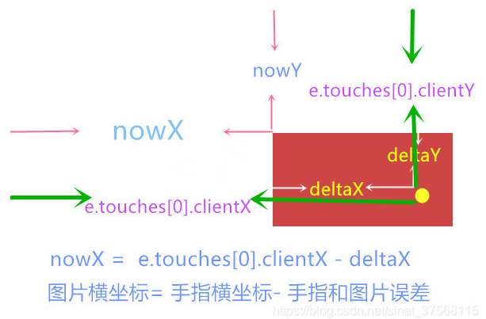

#### 鼠标事件

```js
 		oChar.addEventListener('touchstart', handleTouchStart, false);
          oChar.addEventListener('touchmove', handleTouchMove, false);
          oChar.addEventListener('touchend', handleTouchEnd, false);
```

开始移动结束事件

#### touchstart



1. e.touches[0].clientX  手指的x坐标 

## dataset属性

```js
  `<div class='cell-item' data-index='${index}'>
          <div class="wrapper">${char}</div>
        </div> `
```

要拿到data的值 

利用到dataset.index  可以拿到index的值