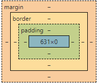

#### Doctype 作用是什么？

1. <！DOCTYPE> 在html文档的最前面告诉浏览器我用这个规范来解析这个html文档
2. 严格模式的排版和js运作模式是这个浏览器支持的最高标准运行
3. 在混杂模式中向后兼容， 环境模拟一个以前的旧版本浏览器。
4. 若doctype 不存在那么就是混杂模式。

#### 行内元素有哪些？ 块级元素？ 空元素？

行:a b span input select strong （强调的元素）

块：div ，标题 ，ol ，li ，dt，dl，dd，p

空元素：  br   hr  img link meta embed  

只有他的功能不显示任何实际的东西 。

####  CSS盒子类型？ 他们的特点是?

类型： IE的盒子，w3c 的盒子

标准：包含内容content，填充padding，边界margin，边框border

ie ： 内容包含了边框和填充的部分      那ie的只有margin  



#### link 和 @import的区别？ 

1. 都是为了加载css文件  两种引入的方式 
2. 类别 : link是html标签  ， @import是css提供的一种方式
3. 加载的顺序： link在浏览器加载的时候同时加载，@import在浏览器加载完毕才开始加载
4. 兼容： link 兼容性好， @import 要在ie5以上才兼容
5. dom操作上： link 可以操作dom  而@import 不可以操作dom 
6. @import 可以反复的引入其他样式表。 

@import书写方式： @import url(style.css)   最好的书写方式。 

#### CSS 选择器哪些，优先级的问题，哪些属性是可以继承的？

1. id ，类，标签，相邻用+号，子选择器用小于号， 后代选择器写在前辈的后面，  *是通配符号 ， 属性选择器用【k：v】的形式写  ， 
2. 属性继承  

可以继承的 ：  字体大小,种类，粗细 ，颜色， UL，LI,DL,DD,DT，

不可以继承的； 边框啊，填充，边框，外边距 ，宽高 。

3. 优先级就近原则，样式定义最近者为准; 载入样式以最后载入的定位为准

**`!important` > 内联样式 `style` > ID 选择器 > 伪类选择器 > 属性选择器 = class 选择器 > 伪元素 > 元素(类型)选择器 > 关系选择器 > 通配符选择器**

#### 浏览器内核，兼容性问题

1.  IE是trident    Mozilla 是 gecko 的   google 是webkit 的， opera 内核是presto

2. 浏览器默认的margin 和padding 不同    

```css
   解决：     *{ margin:0; padding:0;}    
```


