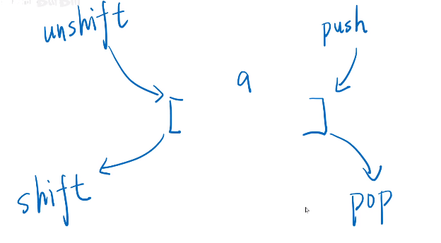
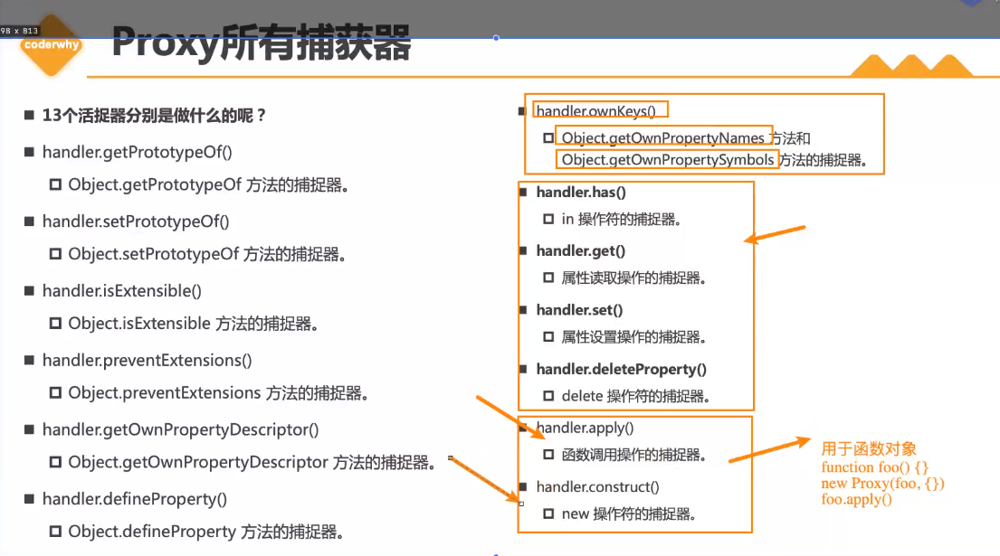
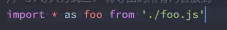

### 数组

push ： 后面插入  可以插入多个             **操作之后返回数组的长度**

pop ： 从后面出来       **不可以出来多个**    返回长度 

unshilt ： 从头部插入     返回长度 

shitft    ：  从头部出来   返回出来的值



 

**数组的用法**

1. 反转字符串

因为字符串中没有自带的反转  所以先将字符串变成数组 调用反转的方法用join 拼接数组

```js
var a  ='abcd'
function reverse(str) {
    return str.split('').reverse().join('');
}
console.log(reverse(a));  // dcba 
```

2. 手写发布和订阅

```js
 var eventbus = {
            arrays: {
                click: [],
                scroll: [],
            },
            on: function (type, fn) {
                this.arrays[type] = this.arrays[type] || [] // 做初始化
                this.arrays[type].push(fn) // push(fn)回调放入到数组中
            },
            emit: function (type, data) {
                const a = this.arrays[type]
                if (!a) return // 防御式编程 没有事件绑定就不for循环
                for (let i = 0; i < a.length; i++) {
                  a[i](data) // 调用a数组中的回调  回调带参数的 
                }          // 一个事件可以有多个回调
            }          // 全部dom都是自带发布订阅接口的
        }
         // 测试！！！！  先绑定 后触发！
        eventbus.on('click', function (data) {
            console.log('clicked' + data);
        })
        setTimeout(function () { eventbus.emit('click','dom元素！！') }, 1000)
```

3. lazyMan 实现

```js
 const LazyMan = function (name) {
            const array = []
            const fn = () => { console.log("Hi! This is " + name + '!'); next() }
            const next = () => {
                const fn = array.shift()
                fn && fn()
            }
            array.push(fn)
            setTimeout(() => { next() }, 0)
            const api = {
                sleep: (number) => {
                    array.push(() => {
                        setTimeout(() => { console.log('Wake up after ' + number); next() }, number * 1000)
                    })
                    return api
                },
                eat: (content) => {
                    array.push(() => {
                        console.log('eat ' + content); next()
                    })
                    return api
                },
                sleepFirst: (number) => {
                    array.unshift(() => {
                        setTimeout(() => { console.log('Wake up after ' + 5); next() }, number * 1000)
                    })
                    return api
                }
            }
            return api
        }
```


###  类数组和Array.from  

1. 类数组转成数组会自动给他加一个length
2. 第三个参数配置   常量   perfix 前缀 可以被使用
3. 只有一个必须的参数 ：array.from.length   的长度为1

```javascript
var obj = {
    0:1,
    1:2,
    2:3,
    length:3
}
const newarr = Array.from(obj,function (item,index) {
    return{
        studentID:this.prefix+item,
        order:index
    }
},{prefix:'no.'})  // 后面也可以加配置 
// foreach   map    filter   every   some   find  都有回调 ， 也有相关的配置
console.log(newarr)
```


### new Object   

##### new 这个过程做了哪些事情？ 

创建空对象 this 指向他继承函数的原型 往这个空对象加属性和方法，新建的对象被this所引用，隐式的返回this  

```javascript
var obj = {};
obj.__proto__ = Base.prototype;
Base.call(obj);
```

new 出来的不是原始值

```JAVA
 var a =1;
        var newA=new Number(a);
        console.log(a===newA);
```

这是原始值这能一样吗？       new 出来的是不一样的东西  new 代表新空间了。  

#### object.keys  / getOwnPropertyNames 

getOwnPropertyNames   忽略了描述符。

```javascript
   var object ={a:1, b:2, c:3, d:4, e:5, f:6}
        Object.defineProperty(object,'b',{
            enumerable:false
        })
    console.log(Object.keys(object))
    console.log(Object.getOwnPropertyNames(object))
```

下面的可以枚举b出来 

#### with 语句

使用 with 语句的主要场景是针对一个对象反复操作  

把对象名字放在with里面默认指向就是with里面的对象如果发现连接不上那就去属性里面找 ，最后操作的不是对象而是属性。

```javascript
with(location) { 
 let qs = search.substring(1); 
 let hostName = hostname; 
 let url = href; 
} 
```

#### 块级作用域

**If语句，switch语句，循环语句等语句块中定义变量**

外部访问不到里面的 变量就是块级作用域 。 

let 和const 不可以重复声明  有块级作用域 。    var  可以  没有块级作用域 。 

 也就是说在上面那些语句包裹的变量在外部可以访问得到 ，  函数内除外。   。 

**执行上下文分全局上下文、函数上下文和块级上下文** 

#### 内存泄漏

1. 不使用上 var、let 或 const 关键字 就声明变量导致变量被加到window上面去了  ，直到网页关闭才会清除
2. 定时器使用变量如何这个定时器不关闭那么这个变量不会去清除
3. 闭包导致，返回函数 函数中需要引用外部的变量   这个函数在调用的时候 就一直不清楚 这个变量 。 。 

### 基本引用类型

1. 引用类型与原始值包装类型的主要区别在于对象的生命周期

就是说基本的引用类型是没有属性的 ，  对象才有属性。 可以去添加属性。

2. 所有对象在布 尔表达式中都会自动转换为 true

3. 理解原始布尔值和 Boolean 对象之间的区别非常重要，强烈建议永远不要使用后者

```javascript
 let falseObject = new Boolean(false);   // 实际是true
let result = falseObject && true;  
console.log(result); // true 
let falseValue = false; 
result = falseValue && true; 
console.log(result); // false 
console.log('--------------------------------------------------------'); //
console.log(typeof falseObject); // object 
console.log(typeof falseValue); // boolean 
console.log(falseObject instanceof Boolean); // true  
console.log(falseValue instanceof Boolean); // false  他是对象吗?  不是
```

对象和原始值是不一样的   1. 对象出来会自动转换成true  2 . 强烈建议使用原始值就行了 。 不要去new 对象   

#### Number 类型 

1. tostring  方法  将数字转成不同进制的数字 。 
2.  tifixed 方法   将数字接受参数   参数表示我要保存几位小数 四舍五入的方式 。  最大是支持20位小数 ，  
3. isInteger  方法 辨别一个数值是否是一个整数 。  

#### Global

ECMA-262 规定 Global 对象为一种兜底对象，它所针对的是不属于任何对象的属性和方法   = 》    全局变量或全局函 数就是他  

 isNaN()、isFinite()、parseInt()和 parseFloat()，实际上都是 Global 对象的方法    

浏览器window 实现他的代理 

####  eval()方法

是一个完 整的 **ECMAScript 解释器**，它接收一个参数，即一个要执行的 ECMAScript（JavaScript）字符串

用来解析js代码的。  

**注意**: eval()的时候必须 极为慎重  要避免xss 的攻击噢。  


#### 迭代方法

 every 和 some 是相反的  传入的函数返回一个true  那结果是true 是some反之必须要全部是true 结果是true 是every      **every每个真才真，some一个真就算真

#### 事件捕获和冒泡

捕获从外到内

冒泡从内到外

#### 代理

```javascript
const proxy = new Proxy(target, handler); 
```

参数一代理目标 对象      参数二捕获器的方法名

代理没有自己的原型  所有instanceof 没有用的

===用来区分代理和目标对象

```javascript
const target = { 
    foo: 'bar' 
   }; 
   const handler = { 
    // 捕获器在处理程序对象中以方法名为键
    get() { 
    return 'handler override'; 
    } 
   }; 
```

handle 是代理的第二个参数也就是捕获器的名字

每当代理需要读取任何属性的时候都会去触发这个方法拿到方法的返回值 。

#### 函数的柯里化

```javascript
function sum(x) {
    return function (y) {
        return function (z) {
            return x + y + z;
        };
    };

    }  
sum(1)(2)(3);
  console.log(sum(1)(2)(3));
```

解释：  柯里化是一种将使用多个参数的一个函数转换成一系列 使用一个参数的函数的技术

#### 创建对象的方法 

1. 字面量创建 

   ```java、
   var obj = {}   
   ```

2. new 出来的对象 

3. 使用显式的构造函数创建的函数          函数名字第一个字母的是大写

4. 利用对象的create 方法 创建 。

#### 原型、构造函数、实例、原型链

1. Object.prototype属性原型链的顶端 。
2. 引用类型（非基本数据类型）都有proto属性，所有函数都有prototype属性是一个普通的对象    

#### Es5 es6 声明一个类

5 函数声明    6 构造器声明

```javascript
class wo{
    constructor() {   
        this.name = name; //  函数直接可以赋值了 。 
        this.sex = sex;
    }
}
wo.sex='name'
console.log(wo.sex);
```

#### call、apply的共同点与区别

都是改变this 的指向  this 指向改变之后就是改变了对象的作用域 。 

apply 后面只可以传一个数组包含全部的参数  

```javascript
var myFun = function (arg1, arg2) {
    return arg1 === arg2
};
//调用
myFun.call(this,1,1); // true
myFun.apply(this, [1, 1]); // true
```

#### 对象的继承

```javascript
function Parent5() {
this.name = 'name';
this.play = [1, 2, 3];
}
function Child5() {
Parent5.call(this);
this.type = 'child5';
}
Child5.prototype = Object.create(Parent5.prototype); // Object.create创建的对象 就
是参数 Child5.prototype.constructor = Child5; var s7 = new Child5();
console.log(s7 instanceof Child5, s7 instanceof Parent5);
console.log(s7.constructor); // 构造函数指向Child5 他是利用chdld5函数构造的
```

**bind **  不可以使用函数声明式  只可以使用函数表达式           绑定之后不会调用 **要自己去调用**

返回的是新对象           上面只是改变函数的this指向

#### 闭包的应用

 函数的嵌套  默认是作用域链是从内往外找变量的 但是闭包可以实现从外部拿到函数作用域里面的变量，并且保持对变量的引用不被垃圾回收 ， 将最外层的函数赋给一个标识符

1. 作为返回值  2. 作为参数来传递

#### 语义化的好处？

H5   (audio,video)    (Canvas)  (Geolocation)  新：webworker, websocket,

（header,nav,footer,aside,article,section）

1. 基本上不用写什么样式就可以正常表示。
2. 利于seo  。
3. 方便其他无障碍设备渲染 。
4. 便于开发维护可读性强，减少差异化。 

#### 浮动的原理

1. 浮动遇到浮动就不可以移动了。 

消除：

1. overflow:auto/ hidden; zoom:1;
2. 加一个空标签   定义cssclear:both  修改两边标签的样式
3. after伪类可以清除浮动。

浮动会发生什么问题

1. 因为浮动起来了所以父元素的高没有元素去撑开
2. 其他元素将会替换掉浮动元素的位置 。
3. 若第一元素浮动了其他元素也要跟着浮动。

怎么解决？

```javascript
.clearfix:after{content:".";display: block;height:0;clear: both;visibility: hidden;}
 .clearfix{display: inline-block;} /* for IE/Mac */
```


#### 浏览器存储

1. 本地离线存储 localStorage 长期存储数据

2. sessionStorage 的数据在浏览器关闭后自动删除

#### null 和undefined 的区别

1. 数值上null 是 0   undefined  是NaN
2. null 表示不存在的对象**不应该有值**，  undefined 表示本来**应该**有值但是没有赋值

#### 手写ajax 是必须的

```javascript
 var xhr = new XMLHttpRequest(); // new 对象
        xhr.open('GET', 'demo.php', 'true'); // 创建请求
        xhr.send()  // 发送请求
        xhr.onreadystatechange = function () { // 根据返回的数据来接受数据
            if (xhr.readyState === 4 & xhr.status === 200) {
            }
        }
```

**get和post**请求方法的区别

1. get 获取信息，url 限制在2000个字符
2. post 修改服务器的数据，  发送的信息没有限制
3. get 是根据url传值，post 通过提交表单来传值

#### JS异步加载和延迟加载

1. 插入script 标签   defer  或者async  实现
2. 创建并且插入  i frame
3. 通过ajax 去获取js代码 然后利用eval执行 。 

#### 同源策略？为什么要有这个？

协议，域名，端口相同，同源策略是一种安全协议。

**为什么？** 

比如一个黑客程序，他利用Iframe把真正的银行登录页面嵌到他的页面上，当你使用真 实的用户名，密码登录时，他的页面就可以通过Javascript读取到你的表单中input中的内容，这样用户 名，密码就轻松到手了。

#### document.write()的用法

document.write只能重绘整个页面。innerHTML可以重绘页面的一部分

#### 事件代理（事件委托）

原本需要绑定的事件绑在父元素让父元素去监听

原理： dom元素的事件冒泡，可以提高性能

#### 说mongoDB和MySQL的区别

monggo是nosql 型的数据库  以二进制的形式来存储的，对海量的数据存储有明显的优势

优点： 1. 最终一致 保证用户的访问速度 2. 文档结构的存储方式 便捷的获取数据 。

#### 304缓存的原理

http码304 状态码    表示了服务器对这个数据没有进行更改 ，不返回任何的内容   

1.  请求 之后  A页面               服务器返回A 页面 并且需要加上 ETag 一起缓存
2. 之后再次发请求这时会带上etag  服务器发现这个页面（带上etag的页面）没有改变 然后返回304  未修改 和空的响应体。  

#### 原型和函数原型

1. 对象的描述符


```javascript
 var obj = {
            _age:18,
            _name:"luohao",
            // set age(value) {
            //     this._age = value;
            // },
            // get age() { return this._age }
        }

        Object.defineProperties(obj, {
            age: {
                configurable:true,
                enumerable:true,
                get: function () { return this._age },

                set: function (value) { this._age = value }
            }
        })
        obj.age=200
        console.log(obj);
//  展示全部的描述符   加s获取全部的属性
        console.log(Object.getOwnPropertyDescriptor(obj,"age")); 
```

两种写法 。  定义多个属性描述符 的方式 

2. 构造函数有缺陷

每次调用都要new 出来函数对象 浪费内存不好

解决： **原型可以解决** 

1. 隐式原型： 取出对象的属性如果实例中没有就会到原型中查找

2. 显示原型


注意：  函数方法放在原型上  ， ，  变量放在实例身上就好了   。

```javascript
  function Person(name, age) {
            this.name = name;
            this.age = age;
        }
        Person.prototype.eating = function () {
            console.log(this.name +this.age+ '我在吃东西噢');
        }
        var p1 = new Person('罗豪',18);
        var p2 = new Person();
        console.log(p1.eating());
```

#### 面向对象 

1. 继承   封装  多态(不明显 )

    原型链变量会顺着原型链去查找需要的变量直到找到。  

   ```javascript
   var obj ={
                  name : '罗豪',
                  age:18,
                msg:  function () {
                      console.log(this.name +'年龄'+this.age+'在'+this.address) 
                  }
              }
              obj.__proto__ ={}
              obj.__proto__.__proto__ ={}
              obj.__proto__.__proto__.__proto__ ={
                  address:'景德镇学院啊'
              }
              obj.msg();
   ```

   这里把景德镇学院放在了第三层原型上但是还是可以通过方法去找到 。  

​      **底层原型**   不管套多少层  最终的底层原型就是 Object.prototype

Ob ject  是所有的类的父类。  。  

需要继承的方法放在原型上 。 

#### Es6面向对象语法糖


##### Es6的中的类


1. 类定义的方式

类的声明 ：

```javascript
  class Test{
     }
     console.log(typeof Test);  // funtion
```

 类的表达式 ： 把名字写在前面 用等号连接

2. 一个类只可以有一个构造函数 

类中的构造函数   new一个类出来和之前的函数对象是一样的过程 

 

3. 静态方法

静态方法就是类方法 ， 通过类名直接来访问的方法 

4. **extends**

super()

super里面写属性名， 其实属性不会放在父类中其实还是在子类的实例中的


**注意**： js引擎要求我们在子类中访问this的时候（或者在return之前）必须super()写在子类的构造函数中，

5. 子类中的方法 

**重写**：

如果对父类的方法不满意我们可以在子类中写方法  这是 子类的方法优先被找到优先被调用不会再顺着原型链去找父类的方法了 

如果要在重写的方法（这个方法和父类是一样的名字因为是重写嘛）里面调用父类的方法可以用super

```javascript
class Test {
            constructor(name, age) {
                this.name = name;
                this.age = age;
            }
            eatings() {
                console.log(this.name + '好帅的');
                return 'aaaaaa'
            }
        }
        class test extends Test {
            constructor(name, age, address) {
                super(name, age);

                // this.address = address;
            }
            eatings() {
                var b = super.eatings();
                console.log(b);
            }
        }
        var a = new test('luohao', 18);
        console.log(a.eatings());
```

静态方法也可以实现 

​    

#### Es8 一些知识点

1. object 的 keys 方法 获取对象的所有的key  
2. object 的 values 方法 获取对象的所有的value 值

```javascript
 const obj = {
            name: 'ddd',
            age: 18
        }
        console.log(Object.keys(obj)); // 返回对象的属性
        console.log(Object.values(obj)); // 返回对象的值
        // 使用比较少 传入数组返回数组  字符串给拆分成数组的形式
        console.log(Object.values(['abc', 'cba', 'nba']));
        console.log(Object.values('abc'));
```

3. object   entries    类似于是map 键值对

```javascript
const obj = {
            name: 'ddd',
            age: 18
        }
        console.log(Object.entries(obj));
        const objEntries = Object.entries(obj)// 获得值键对集合
        objEntries.forEach(item=>{  // 遍历item 输出两个item
            console.log(item[0],item[1]);
        })
        // 如果是数组  他的k 值就是下标  。
        console.log(Object.entries(['a', 'b', 'c']));
```

返回对象的map键值对，  如果是数组下表为他的k值 。

#### String  padding  

字符串填充 。 padStrat()   padend()     用于银行卡号，和身份证号隐藏

```javascript
const cardnum= "12312312315456465"
// 从后面开始截取
const lastfourcardnum= cardnum.slice(-4)
const finalcardnum= lastfourcardnum.padStart(cardnum.length,'*')
console.log(finalcardnum);
```

身份证前面全是*  后面保留4位。 

#### 监听对象的操作


```javascript
var obj ={
    name: 'ddd',
    age:18
}
Object.keys(obj).forEach(key => {
    let value=obj[key];
Object.defineProperty(obj,key,{
    set:function(newValue){
        console.log(`监听到了给${key}设置值`);
        value= newValue
    },
    get:function(){
        console.log(`监听到获取${key}的值`);
       return value;
    },
})
})
obj.name='kobe'
obj.age=20
```

实现了 监听获取和设置过程  ，但是优缺点 ？ 监听不到加入的属性和删除的属性

#### 代理对象 

解决上面的缺点 因为我们通过代理获得代理对象重写他的get ，set 劫持到数据的改变

```javascript
  var obj = {
            name: 'ddd',
            age: 18
        }
  // 参数目标对象和 			 拦截器对象  
        const objProxy = new Proxy(obj, {
            set: function (target, key, newValue) {
                console.log(`监听到了给${target}对象的${key}属性被设置了`);
                target[key] = newValue
            },
            get: function (target, key) {
                console.log(`监听到了给${target}对象的${key}属性被访问了`);
                return target[key]
            },
        })
        console.log(objProxy.name);
        console.log(objProxy.age);
        objProxy.age = 20;
        objProxy.name = 'aaaa';
// 原型上的数据也被改变掉了 。  
```

JS 代理我们不仅可以**重写 getters 和  setters 方法**，我们还可以进行这些操作：deleteProperty、construct、getOwnPropertyDescriptor 等...

1. 代理对象第二个参数还有很多捕获器



```javascript
function foo() {

        }
        const objProxy = new Proxy(foo, {
            // target 目标函数， thisArg是apply的参数， arrArray是额外的参数
            apply: function (target, thisArg, arrArray) {
                console.log('对foo函数进行了apply 的调用');
                return target.apply(thisArg, arrArray);
            },
            construct: function (target, arrArray, newTarget) {
                return new target(...arrArray)
            }
        });
        objProxy.apply({}, ['abc', 'cba'])
        new foo('abc', 'cba')
```

一个handle.apply 的例子  。。 当改变函数的this时候会被捕获到 。 

#### Reflect  的作用  

原来需要利用代理来捕获的  现在直接使用reflect 上面的方法就行了


```javascript

        function foo() {}
        const objProxy = new Proxy(foo, {
            // target 目标函数， thisArg是apply的参数， arrArray是额外的参数
            apply: function (target, thisArg, arrArray) {
                console.log('对foo函数进行了apply 的调用');
                return Reflect.apply(target, thisArg, arrArray);
            },
        });
        objProxy.apply({}, ['abc', 'cba'])
        new foo('abc', 'cba')
```

这个api设置的时候会给你返回一个布尔值 ， 和手动的设置不一样的。普通的监听不到设置的结果（成功或者失败）

不对原来的对象做操作 ，如果用代理还去操作对象的话那就违背了代理的初衷

#### Rcevier

就是代理对象 第三个参数  


可以改变this     那个位置的参数就是改变this的，传其他的对象也可以（但是无意义）

#### Reflect 的construct 

在需要构造一个对象必须要通过一个函数去构造的情况下（在函数中不可以使用super）

```javascript
function Student(name ,age) {
            this.name = name;
            this.age = age;
        }
        function Teacher(){
        }  //  第三个参数代理对象 
        const teacher=Reflect.construct(Student,['why',18],Teacher)
        console.log(teacher); // 就是一个Teacher 对象 
        console.log(teacher.__proto__===Teacher.prototype);// true
```

#### 响应式原理实现

```javascript
let reactiveFns=[];
function watchFn(fn) {
    reactiveFns.push(fn);
} 
var obj ={
    name: 'ddd',
    age:18
}
watchFn(function() {
    const newName= 'luohao'
    console.log('你好 罗豪');
    console.log('hello world');
    console.log(obj.name);
})
watchFn(function() {
    console.log(obj.name,'============ ');
})
obj.name='kobe';
// 将保存在数组里面的函数 遍历出来
reactiveFns.forEach(fn=>{
    fn();
})
```

1. 用数组去收集响应式的函数不好 

```javascript
class Depend {
            constructor() {
                this.reactiveFns = []
            }

            addDpend(reactiveFns) {
                this.reactiveFns.push(reactiveFns);
            }
            notify() {
                this.reactiveFns.forEach(fn => {
                    fn()
                })
            }
        }
        const depend = new Depend();
        function watchFn(fn) {
            depend.addDpend(fn)
        }
        var obj = {
            name: 'ddd', // depend对象
            age: 18	// depend对象
        }
        watchFn(function () {
            const newName = 'luohao'
            console.log('你好 罗豪');
            console.log('hello world');
            console.log(obj.name);
        })
        watchFn(function () {
            console.log(obj.name, '============ ');
        })
        obj.name = 'kobe';
        // 将保存在数组里面的函数 遍历出来
		// 不好，应该让他自动监听
        depend.notify()
```

2. 封装一个类去收集  。
3. 利用代理，监听属性的变化  在代理里面调用depend.notify()方法

实现了自动监听的属性变化

```javascript
  const objProxy =new Proxy(obj,{
        get : function( target ,key,receiver) {
            return Reflect.get(target,key,receiver)

        },
        set : function( target ,key,newvalue,receiver)
        {Reflect.set(target,key,newvalue,receiver);
            depend.notify()

        }
    })
```

创建代理对象，后面的obj 全部改成objProxy

4. 对象依赖管理   **WeakMap**


把一个对象属性变化放在同一个Depend 对象中是不对 的 ，假设有一个info对象 那么应该放入到info对象的Depend 里面


放入到正确的depend 里面

```javascript
 // 把需要响应式的函数放在数组里面
 class Depend {
            constructor() {
                this.reactiveFns = []
            }
            addDpend(reactiveFns) {
                this.reactiveFns.push(reactiveFns);
            }
            notify() {
                this.reactiveFns.forEach(fn => {
                    fn()
                })
            }
        }
        let adctiveReactiveFns =null
        function watchFn(fn) {
            adctiveReactiveFns = fn
            fn()
            adctiveReactiveFns=null
            
        }
        const targetMap = new WeakMap();
        function getDepend(target, key) {
            let map = targetMap.get(target);
            if (!map) { 
                map = new Map();
                targetMap.set(target, map);
            }
            // 这里要做判断不要去用const 用let
            let depend = map.get(key);
            if (!depend) {
                depend = new Depend();
                map.set(key, depend);
            } 
            return depend;
        }
        var obj = {
            name: 'ddd',
            age: 18
        }
        const objProxy = new Proxy(obj, {
            get: function (target, key, receiver) {
                const depend = getDepend(target, key); 
                depend.addDpend(adctiveReactiveFns)
                return Reflect.get(target, key, receiver)

            },
            set: function (target, key, newvalue, receiver) {
                Reflect.set(target, key, newvalue, receiver);
                const depend = getDepend(target, key);
                depend.notify()
            }
        })
        watchFn(function () {
            const newName = 'luohao'
            console.log('你好 罗豪');
            console.log('hello world');
            console.log(objProxy.name);
        })
        watchFn(function () {
            console.log(objProxy.name, 'name 改变1111' );
        })
        watchFn(function () {
            console.log(objProxy.age, 'age改变1111 ');
        }) 
        watchFn(function () {
            console.log(objProxy.age, 'age改变2222' );
        })
        objProxy.name = 'kobe';
        // 将保存在数组里面的函数 遍历出来
```

过程：


放在正确的依赖里面了   

```javascript
       let adctiveReactiveFns = null
        // 把需要响应式的函数放在数组里面
        class Depend {
            constructor() {
                this.reactiveFns = new Set();
            }
            // addDpend(reactiveFns) {
            //     this.reactiveFns.push(reactiveFns);
            // }
            notify() {
                this.reactiveFns.forEach(fn => {
                    fn()
                })
            }
            depend() {
                if (adctiveReactiveFns) {
                    this.reactiveFns.add(adctiveReactiveFns)
                }
            }
        }


        function watchFn(fn) {
            adctiveReactiveFns = fn
            fn()
            adctiveReactiveFns = null

        }
        const targetMap = new WeakMap();
        function getDepend(target, key) {
            let map = targetMap.get(target);
            if (!map) {
                map = new Map();
                targetMap.set(target, map);
            }
            // 这里要做判断不要去用const 用let
            let depend = map.get(key);
            if (!depend) {
                depend = new Depend();
                map.set(key, depend);
            }
            return depend;
        }
        function reactive(obj) {
            return new Proxy(obj, {
                get: function (target, key, receiver) {
                    const depend = getDepend(target, key);
                    depend.depend()
                    return Reflect.get(target, key, receiver)

                },
                set: function (target, key, newvalue, receiver) {
                    Reflect.set(target, key, newvalue, receiver);
                    const depend = getDepend(target, key);
                    depend.notify()
                }
            })
        }
        const objProxy = reactive({
            name: 'ddd',
            age: 18
        })
        const fooProxy = reactive({
            name: 'foo'
        })
        const infoProxy = reactive({
            address: '上海',
            height: 1.88
        })

        watchFn(() => {
            console.log(fooProxy.name);
        })
        fooProxy.name = 'bar'
        // 将保存在数组里面的函数 遍历出来
```

set 是add方法 但是 map 是push 方法

​									**至此前面就是vue3的响应式原理**

#### vue2中的响应式原理

vue3使用的是代理  但是vue2 使用的是object.defineprotype

```javascript
  function reactive(obj) {
             Object.keys(obj).forEach(key =>{
                 let value = obj[key];
                 Object.defineProperty(obj,key,{
                get: function ()  {
                    const depend = getDepend(obj, key);
                    // 收集依赖
                    depend.depend()
                  return value;
                },
                set: function (newValue) {
                    value =newValue           
                    const depend = getDepend(obj, key);
                    depend.notify()
                }
            })
            })
            return obj;
        }
```

#### Promise 

1. 原始的promise 

```javascript
 function requestData(url, successCallback, failureCallback) {
            setTimeout(() => {
                if (url === '200') {
                    let name = ['abc', 'cdef', 'das'];
                    successCallback(name)
                } else {
                    let errmessage = '失败了'
                    failureCallback(errmessage)
                }
            }, 3000)
        }
        requestData('200', (res) => {
            console.log(res);
        }, (err) => {
            console.log(err);
        })
```

不好！   每个人封装的不一样 参数都不一样 。

2. 更好的方案  promise 承诺 

不管前面写的是什么 后面一定会有一个结果 ，

异步的请求方法放在exctor 里面 

   

```javascript
  function foo(){
       return new Promise((resolve, reject) => {
        resolve('成功了')
       })
    }  
    const fooPromise =foo();
    fooPromise.then((res) =>{
        console.log(res);err
    },(err) => {
        console.log(err);
    })
```


更加的规范了 。

3. Promise代码的结构 


4. then 方法传入的回调有返回值

1. 如果是普通值， 那么这个普通值会被作为新的promise 的放在一个新的reslove **包裹在promise里面**

2. promise 的链式调用 是产生了一个新的promise    return 的值就是新的promise 的参数**res**     

```javascript
   const promise = new Promise((resolve, reject) => {
            resolve('hahahah')
        })
        promise.then(res => {
            return  11111
        }).then(res => {
            console.log(res);
        })
```

相当于是修改上面 return **设置链式的then 下面的res参数的值 **

3. 上面说返回的是一个 **普通的值自动new一个promise**  那返回 一个  new promise 呢？那么这时 new  Promise（reslove=》reslove(x))  这里的 x 就是new Promise 

一个promise 的返回值决定 reslove 返回的东西

```javascript
const promise = new Promise((resolve, reject) =>{
        resolve()
     });
     promise.then(res=>{
         return{
             then:function(resolve, reject){
                 resolve(2222)
             }
         }
     }).then(res=>{
         console.log('res:',res);
     })
```

只有上一个promise 的reslve方法被调用了 才能继续下一个promise 


4. catch 

```javascript
const promise = new Promise((resolve, reject) => {
            throw new Error('dadasdasda')
        });
        promise.catch(err => {
            console.log('err', err);
        })
```

catch 方法会捕获new Error 的错误  和reject 的错误 

```javascript
const promise = new Promise((resolve, reject) => {
           reject('dasdasdasda')
        });
        promise.then(res => {
        }).then(res=>{
            throw new Error('then error');
        }).catch(err => {
            console.log('err:',err);
        })
```

catch 优先捕获最前面的异常  如果第一个promise 没有异常的话就会捕获第三个new Error 里面的异常

5. **Promise 类的方法**

1. reslove方法


```javascript
function foo(){
     const  obj= {name:'dad'}
     return new Promise((resolve, reject)=>{
         resolve(obj)
     })
 }
 foo().then(res=>{
     console.log('res:',res);
 })
```

分析上面的代码 相当于是直接返回reslove结果

```javascript
const promise =  Promise.resolve({name:'ccc'})
promise.then(res=>{
    console.log('res:',res);
})
```

这个传入了一个普通的值如果是promise那会是怎样呢

```javascript
const promise =  Promise.resolve(new Promise((resolve)=>{
    resolve('成功')
}))
promise.then(res=>{
    console.log('res:',res);
})
```

传入的是promise 对象之后就是  **在这个promise 的结果就是下一个promise 的res**

2. reject 方法

```javascript
const promise =  Promise.reject(new Promise((resolve, reject)=>{
    reject('失败')
}))
promise.then(res=>{
    console.log('res:',res);
}).catch(err=>{
    console.log('err:',err);
})
```

分析一波，第一行代码reject 后面**不管传什么** 都是代表错误的内容(被catch的内容）。

reject是需要catch 来捕获的。

```java
const promise =  Promise.reject('dasdasdas')
promise.catch((err)=>{
    console.log(err);  //   dasdasdas   
})
```

3. Promise.all   

一个数组

```javascript
const p1 =  new Promise((resolve, reject) => {
    reject('1')
})
const p2 =  new Promise((resolve, reject) => {
    resolve('2')
})
const p3 =  new Promise((resolve, reject) => {
    resolve('3')
})
Promise.all([p1, p2, p3]).then(res=>{
    console.log(res);
}).catch(err=>{
    console.log(err);
})
```

如果全部是resolve 那么他就会把reslove 的结果以数组的形式给返回

如果中途有一个reject 那么他会返回**第一个reject** 的结果返回  

4. allsettled 方法


```javascript
const p1 =  new Promise((resolve, reject) => {
    reject('1')
})
const p2 =  new Promise((resolve, reject) => {
    reject('2')
})
const p3 =  new Promise((resolve, reject) => {
    resolve('3')
})
Promise.allSettled([p3, p1, p2]).then(res=>{
    console.log(res);
}).catch(err=>{
    console.log(err);
})
```


分析： 解决了all 方法一旦出现reject 就只返回第一个reject 结果的问题

这个allsettled 从字面意思来看就是  等待全部的结果敲定之后返回他们（promise）的全部的结果  也是以数组的形式 

#### 用计数器来实现promise.all

```js
   const p1 = new Promise(( reject) => {
            reject('1')
        })
        const p2 = new Promise(( reject) => {
            reject('2')
        })
        const p3 = new Promise((resolve) => {
            resolve('3')
        })
        Promise.allFn = function (val) {
            return new Promise((resolve, reject) => {
                let count = 0;
                let result = [];
                const len = val.length
                val.forEach((item, i) => {
                    Promise.resolve(item).then(res => {
                        count++;
                        result[i] = res;
                        if (count == len) {
                          resolve(result)
                        }                
                    }
                    ).then(err => {
                        console.log('err');
                    })
                    return 0
                })
            }).catch(err => {
                console.log(err);
            })
        }
        Promise.allFn([p1, p2, p3]).then(res => {
            console.log(res);
        }).catch(err => {
            console.log(err);
        })
// 三个函数 三个都成功就实现一个函数
// 先写三个promise  reject 和resolve 随便 
// 在Promise 对象上挂载一个 all 方法  不要同名
//  参数是一个数组  名字就取var 把 ，
// 方法返回一个 new  Promise  声明变量count 用来计数
// result 数组存放结果  如果长度 
// 传入的promise数组val 用foreach 遍历出来 参数 一个是item 一个是 i 下标
// 然后需要利用promise.solve方法去收集 成功的 如果成功就加一并且把成功的结果res放进result
// 相应的下标上去  如果 这个count 等于传入val.lenth 那么全通过了返回result就行了 
// 如果捕获（catch） err 之后直接打印 err的结果就好了
```

#### 手写promise

1. promise 类的设计    两种设计 

class myPromise{}

function myPromise（）{}

2. 构造函数

```js
    class myPromise{
constructor(executor){
    // 定义状态
    // 定义reslove reject 的回调
    // reslove 执行任务的队列，改变状态
    // 获取value then 传入执行成功的回调
    // reject 执行任务的队列 ，改变状态
    // 获取reason then传入执行失败的回调

    // try catch  
    executor(resolve,reject);
}
    }
```

3. then 方法 

   ```js
     class myPromise{
   then(onfulfilled,onrejected){
       // this.onfulfilled = onfulfilled
       this.onrejected = onrejected
       
     // 判断 onfulfilled，onrejected 会给默认值
    // 返回promise  reslove 和reject  
    //  判断之前的promise 状态是否确定（fulfilled)
    // onfulfilled,onrejected 直接执行（捕获异常）
     // 添加到数组中 push(()=>执行onfulfilled，onrejected
     // 直接执行代码  )  
   }
   }
       }
   ```

   4. catch 方法

   ```js
     class myPromise{
   catch(onrejected){
       return this.then(undefined,onrejected);
   }
       }
   ```

5. finally 方法

```js
class myPromise{
        finally(onfinally){
            return this.then(()=>{
                onfinally()
            },()=>{
                onrejected()
            })
        }
    }
```

6. resolve和reject 

略。

7. all/allsettled

核心 ：  要知道new promise 的reslove ，reject 在什么情况下执行

 all： 全部的成功按传入的数组顺序执行promise  若有一个失败 返回第一个失败的结果 

allsettled ： 一定是全部结果出来 ， 不管结果怎么样 ， 都要有结果但必要reslove

8. race 和any 

race ：只需要有结果   

any： 情况1. 必须得到一个reslove 的结果，  情况二如果没有reslove 那么全部都是rejected

### 参数作用域

1. 参数的意义是给函数提供东西  

如果函数内部已经声明了就访问函数内部的，如果函数内没有就去参数作用域去找

2. 当函数参数有默认值的会有一个作用域  ，没有默认值默认为undefined ， 
3. 寻找变量的过程是如果本作用域里面没有就会 **往外层去寻找**


```js
   var x = 0;
        function foo(x, y = function () {
            x = 3; console.log(x);
            ;
        }) {
            console.log(x);
            var x = 2
            y();
            console.log(x);
        }
        foo(); 
        console.log(x);
```

### 进程和线程


#### **浏览器中的线程**


#### **时间循环**


将异步的任务放进事件队列中等			计时完成就将事件抛出去进入到主线程中

****

#### 微任务和宏任务

回调函数需要加入到队列中， 

但是事件队列也要分成 **宏任务队列和微任务队列**

宏任务队列： 定时器， ajax ，dom ，uirending

微任务： promise  then  

**规范**  微任务清空之后再执行宏任务

 


#### promise 面试题 

1. 微任务和宏任务


```javascript
setTimeout(function() {
       console.log('settimeout1');
new Promise((res)=>{
    resolve()
}).then(()=>{
    new Promise((res)=>{
        resolve()
    }).then(()=>{
        console.log('then4');
    });
    console.log('then2');
})
   })
   new Promise((res)=>{
       console.log('promise1');
       resolve()
   }).then(()=>{
       console.log('then1');
   })
   setTimeout(()=>{
       console.log('settimeout2');
   })
   console.log(2);
   queueMicrotask(()=>{
       console.log('queueMicrotask');
   })
   new Promise((res)=>{
       resolve()
   }).then(()=>{
       console.log('then3');
   })
```

2. 异步任务

**题目1**


```js
 async function bar(){
     console.log('2222');
     return new Promise((resolve)=>{
         resolve()
     })
 }
 async function foo() {
     console.log('11111');
     await bar();  // 等bar 执行完成再执行下面的 
     console.log('3333');
 }
 foo();
 console.log('4444444');
```

结果是 1   2   4   3     在执行bar 的时候我们foo函数下面的会被放入到reslove里面形成微任务的

所以先执行main scprit 的代码    **也就是await 后面会被加入到微任务的队列中的**

**题目2**

```js
async function async1(){
    console.log('asncy 1 start ');
    await async2();
    console.log('async1 end');
}
async function async2(){
    console.log('asncy 2 start ');
    return  undefined;
}
console.log('主线成开始');
setTimeout(()=>{
    console.log('setTimeout');
},0)
async1()
new Promise((resolve)=>{
    console.log('Promise1');
    resolve();
}).then(()=>{
    console.log('Promise2');
})
console.log('主线程结束 ');
```

```js
主线成开始
 asncy 1 start 
 asncy 2 start 
 Promise1
 主线程结束 
 async1 end
 Promise2
 setTimeout
```


注意settimeout 是宏任务


 


### Node 的事件循环


### node中的宏任务和微任务


### Node事件循环的顺序


**题目1**


### 异常处理


```js
  function foo(type) {
            if (type === 0) {
                throw new Error("错了")
            }
        }
        function bar() {
            try {
                foo(0);// 如果foo发生异常程序不会终止而是
                // 被catch到错误 
            } catch (err) {//存放err错误  err.message拿到错误信息
                console.log('err：', err.message);
                alert(err);    // 提示用户出错了。 
            }
        }  // 无异常不会被中断
        bar()  //  判断foo的参数是否是异常的参数 
```

#### finally 

不管发布发生错误都会执行

一般做一些close 操作  

### 模块化 （很重要）

一个文件就是空间


早期： 函数有自己的作用域  但是全局用不了  通过函数返回一个对象  

社区形成规范   Es moudule 是官方的规范


### common Js   规范

Node 是使用这种规范


webpack的配置还是用的common js

1. 导出的方案


moudel.exports 是一定导出 

### 模块的加载过程


### Es  模块  


#### es模块的基本使用

使用了标签里面引入 就不能使用import 引入

**不使用live server 就会发送跨域**

一般在导入的时候取别名

导入起别名：

```js
import { name as a , age  as b} from './a.js' 
```

 

#### 结合使用

导出的方法


生成了一个index.js 在utils 里面  然后所有的包在index.js导出

```js
import { name, age } from './a.js'
import { foo } from './b.js' 
export {name ,age , foo}
```

在index.html 使用

```js
  <script src='./main.js' type='module' >    </script>
```

#### Default 使用

最重要的东西是默认导出的

```js
import name from "./utils/"
```

默认的只可以有一个  。  不可以多次导出 

**导入方式之间不要冲突**

### Es module 的解析过程


type 是模块化的     type =‘module’

import 只可以放在外层 函数不可以  **一定是确定的**

1. 构建阶段


2.  实例化阶段


3. 内部原理

静态分析和动态运行两部分组成 。 先是静态后面是真正的去计算值。 

**第三方使用common js**

### 包管理器


两种管理包的方式  显然选择第二种

1. npm


如何使用？

属性：


 
