### Diff算法

#### 有key

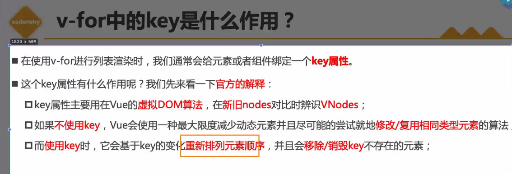


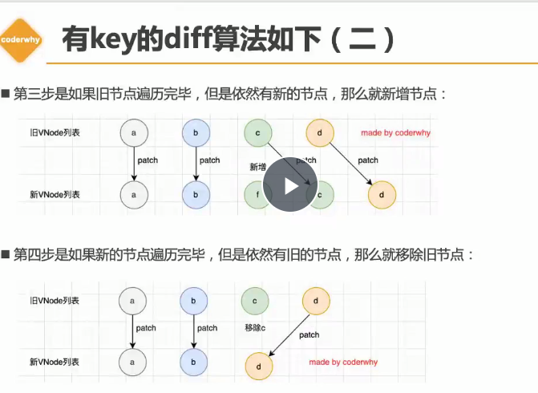

**红黑树的删除操作**

### 计算属性

#### 比method 返回值好在哪里 ？ 

1. method要反复的去调用，在插值语法{{}}中不容易看出插入的到底是什么东西  看到是一个方法名和一个括号
2.  计算属性有缓存  **只执行一次**

**对数据进行一些复杂的处理**


#### 对象的引用赋值， 和对象的浅拷贝

引用赋值是同一个对象

拷贝是两个对象

当一个对象里面还有一个对象之后，对象对自身内部的对象也是引用赋值 ，  当其他的对象拷贝这个对象的时候  拷贝到的就是一个 对象的引用  虽然对象本身 改变  复制之后的对象不会改变 但是在对象里面的那个对象  被复制的对象继续引用  /

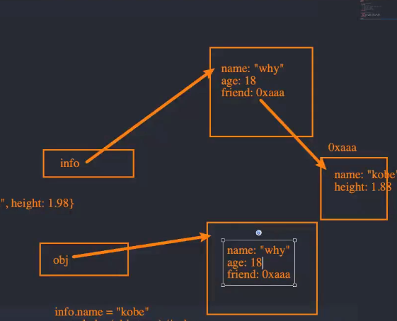

```js
const obj = {
    name :'why',
    age:234,
    friends :{
        name:'hello',
        age:13
    }
}
const info = Object.assign({},obj);
console.log(info);
obj.friends.name='luohao'
console.log(info);
```

怎么样深拷贝 

```JS
const info = JSON.parse(JSON.stringify(obj));
```

深拷贝不会造成上面的情况 ， 就是对象里面的对象不会拷贝他的引用  而是改变了引用的地址 ， 形成了一个新的对象

### 组件

vite更新不好需要手动刷新 ， 还是有一些问题

#### v-model

双向绑定 ， 本质是一种语法糖

``` js
 v-model can only be used on <input>, <textarea> and <select> <radio>  <label>
```

背后两个操作 ， 绑定一个：value   和 监听事件 ，  不断的去修改  调用修改的方法 

背后其实更复杂的。 

radio  本身是互斥的   

##### 修饰符

lazy  number  trim 去除 空格  

### 组件化开发 

#### vue的组件化 

1. 注册  

```js
  app.component('app-a',{
          template : '#app-a'
        })
```

全局注册的组件在所有的组件中都可以使用

组件的data写在组件中  methods

2. 局部注册

在组件中的components：  {} 对象中写组件的名字 可以es6简写 。 

### webpack

1. 配置文件

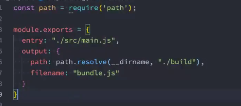

2. loader

用于解析模块

-d 在加载的时候 才运行 这个loader

在webpack.config.js 配置文件中的moudel 中的rules 来给loader配置相关  ，    说一下遇到什么文件的时候启动loader

less-loader =》 css-loader =》 style-loader 的文件 

3. postcss

插件autoprefix  自动加上前缀的插件 

给css 加上浏览器的前缀 。   

配置方案 : 

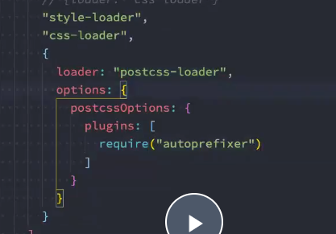

当使用到postcss-loader  的时候 会使用到插件 。 

4. postcss -prest -env

预设的环境    把现在的css 转成 浏览器认识的css

### webpack打包 

1. file loader 打包 

对文件的图片资源进行打包 

图片的名称不好看   如果不配置的话会随机的名称hash值防止重复

文件命名的规则可以配置  

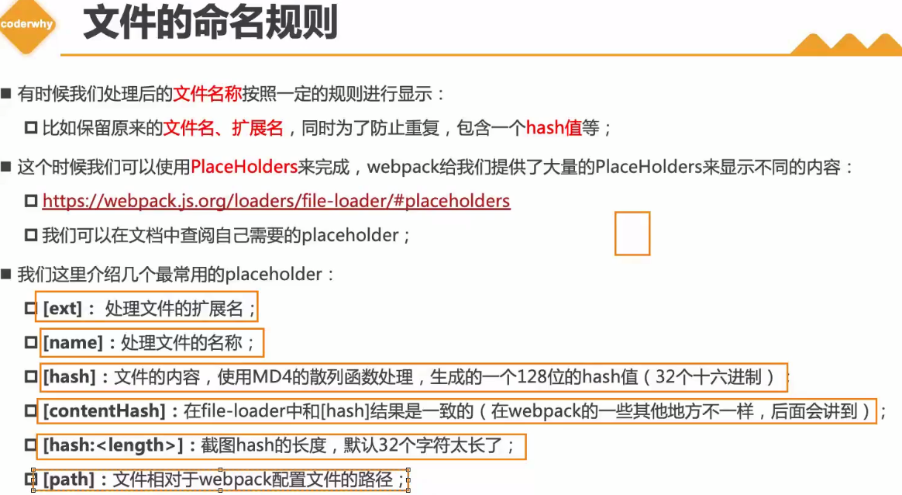

使用的是palcehoders

同样是在options里面配置的是

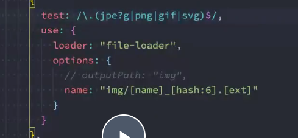

outpath 设置  文件打包的出口

2. url -loader

和file -loader 类似 ，  

但是可以将**小文件** 可以转成base64的url

大文件就不要转了

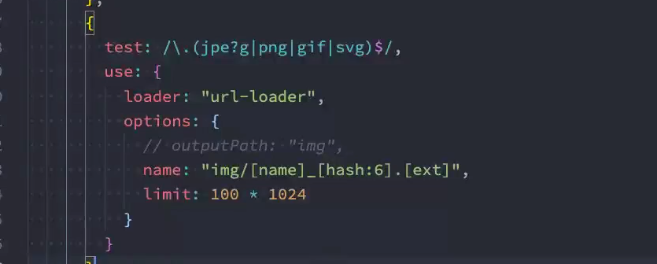

限制图片的大小

### babel

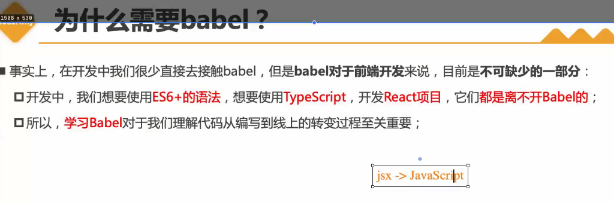

到底是什么东西  搞半天 ， 是工具链， 语法转换源代码转换的作用

1. 如何使用？

安装预设preset   转换的内容比较多这个时候我们要配置到底什么东西要转成什么东西 

2.  底层原理 


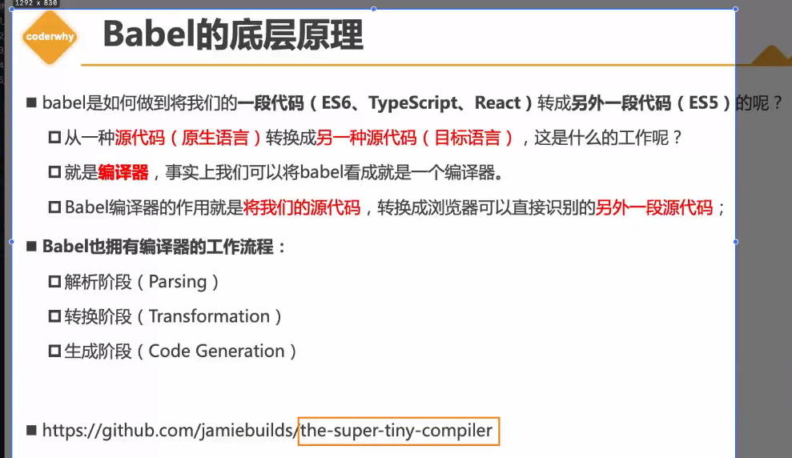

源代码比较优秀可以看一下 。 

过程是 ：  原生的代码 ， 解析  ，转换    ， 代码生成 

目标的源代码  

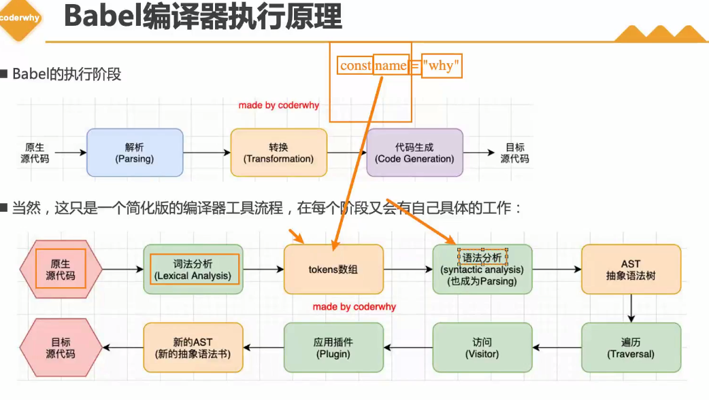

和浏览器v8 渲染dom  差不多 ，  

3. 配置

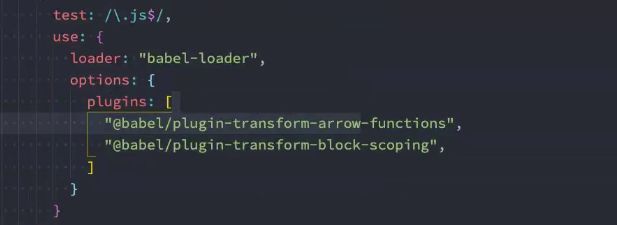

配置预设

### Devserve

#### webpack 的watch

在build 后面-- watch  就配置成功了 。

 导出的配置watch ： true      在moudle.exprot

很少使用  没有自动刷新  ，自动刷新是live  reloading

#### webpack -dev -server

####   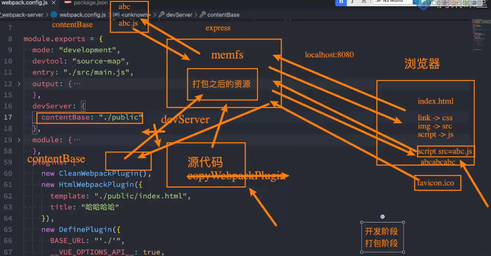

#### contentBase 拷贝资源加载


#### 模块的热替换

在程序运行中  **替换删除添加**  而无需重新去刷新整个页面 

模块当成整体 ，  一个模块修改  就刷新浏览器  

  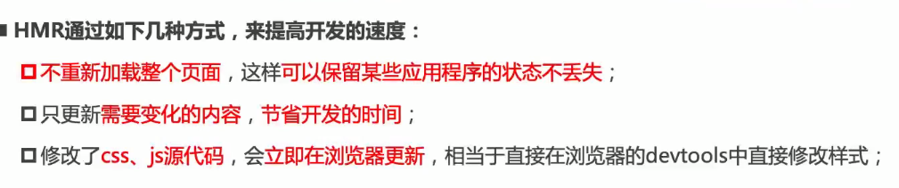

 

vue-loader 

框架中已经有了自己的方案 。
