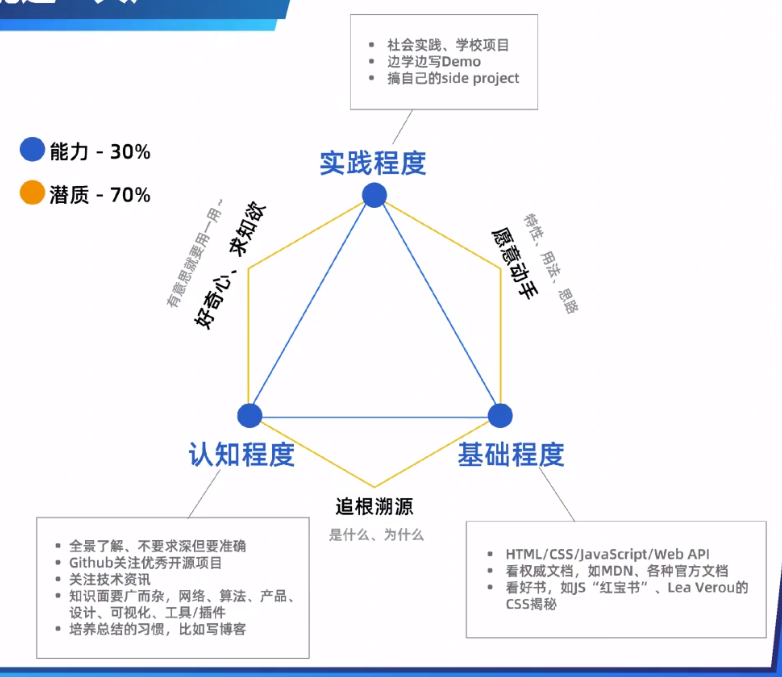
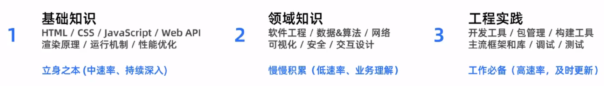
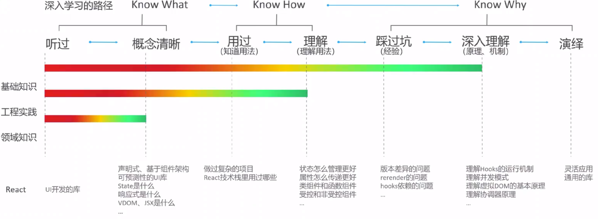
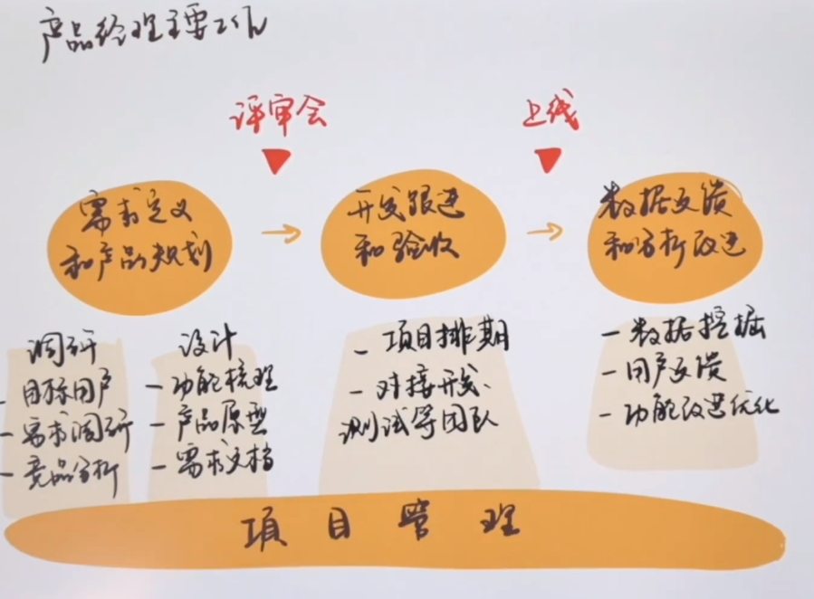
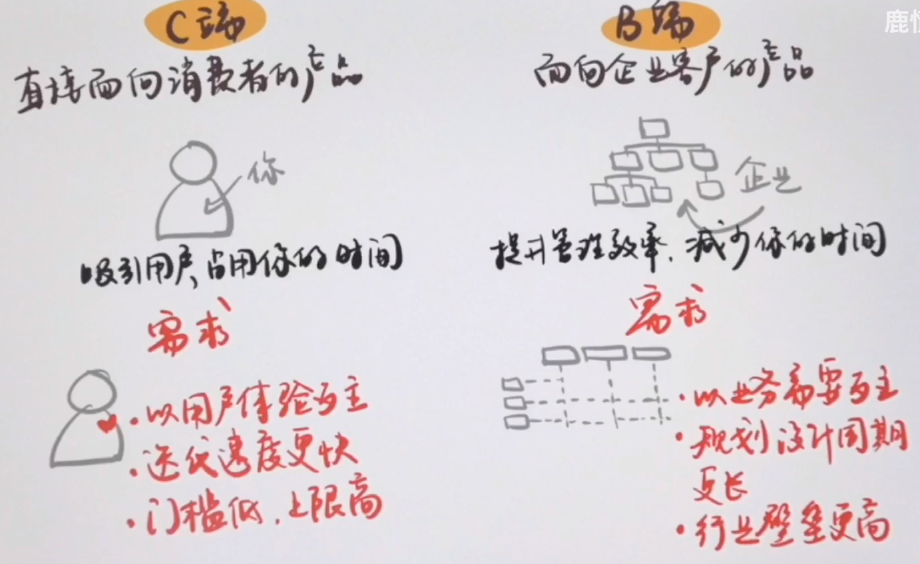

## 学习理念：多看多敲，代码量提示，	返回递归过程：发现问题，解决问题，总结经验。（总结他人的经验）。白嫖精神

### 前提      

**时间和身体**  时间成本 和 身体成本 

**坚持每天做好总结**

### 记忆会被篡改

​	记忆不能复制 ，记忆有一部分记在身体

梦的感觉是完全是真实的

曼德拉效应，写下来的才是真的   记住的是不稳定的

### 马斯克

阅读量很重要读书很重要 。

面试是很重要获取信息的渠道马斯克在面试的途中就在偷学知识

分治思想  马斯克的第一性原理的本质   

跨领域学习  各种可能结合 。

迁移学习   ，利用到另一个行业 将知识转化为更深层的更抽象的思维模型有利于迁移学习

1. 对比法	观察不同的案例  比较对比 

2. 身边时优秀的人才

3. 第一性原理的思维

### 学习模式

1. 专注模式和发散模式，不要过于专注于某一件事情需要发散思维  ，
2. 构建概念组块 。整组的概念
3. 回想很重要 ，认真读一次就好了然后去反复的回想
4. 学会x之后就要去学别的东西 不要一直学一样的东西
5. 睡觉很重要 ，  
6. 已知解析未知     间隔的练习， 及时复习 。 。 
7. 解析东西  去面试 ，多面试找到自己的不足的地方 。
8. 最好的方法就是自学。  。 。 。 

### 哲学的三大问题

我是谁来自哪里要到哪里去 ？

时间成本是人这一生最昂贵的一个成本

时间价值，工作不要机械的重复做一样东西一定要提高自己的时间价值。

要喜欢上自己正在做的事情。

承认自己普通，只和自己去比较，就算是失败了也要去分析失败的原因

了解自己，人生决定权不能交给别人

包容和尊重

### 老马的采访

说客： 劝说别人接受某种主观

入口不够 。

创新成功

### 习惯

1. 每天要拉伸 ，慢跑
2. 减少工作时间提高工作效率
3. 每天早上需要写日记，要完成的事情。
4. 生气的时候不要去做事情了。
5. 聪明的分配时间
6. 不要去做口舌之战
7. 任务分成小步骤。
8. 不要和别人去比较
9. 每天去读书15分钟

### 思维  

1. 查找做什么是对的时候要看做什么是错的。

2. 内卷的解决方案打造生态链，小米内卷了但是扩展了其他的智能家居相关的

3. 做减法，砍掉全部不重要的任务，消灭一些生活中不需要的东西 ， 有时候极简主义看上去很不错，**东西全都是简单的** 追求简单 。

### 哲学

悲剧不是悲观

道德起源于强者于弱者的社会斗争

### 互联网寒冬

大量裁员，互联网利润来源广告， 现金流，

### 民粹主义

**民粹主义**（populism），又译**[平民主义](https://baike.baidu.com/item/平民主义/5172278)**，是在19世纪的俄国兴起的一股社会思潮。民粹主义的基本理论包括：强调平民群众的价值和理想，把平民化和大众化作为政治运动和政治制度合法性的最终来源；依靠平民大众对社会进行改革，并把普通群众当作政治改革的决定性力量；通过强调诸如平民的统一、全民公决、人民的创制权等民粹主义价值，对平民大众从整体上实施有效的控制和操纵

### 学习程序

1. 要求：

2. 多线程学习

3. 如何深入的学习

### 六顶思考帽子

- 蓝帽，开始，给出问题，给出标准。

- 绿帽，开始无约束地做发散思维，开始胡扯。

- 白帽，给出现有数据。

- 红帽，给出一个直接判断，与个人意向。

- 黄帽，评估优势。

- 黑帽，评估劣势。

- 蓝帽，决策。

  整个流程可以是嵌套反复的

### 沟通

1. 沟通中和别人的利益搭边
2. 理解不代表认同 

### 产品方向

#### 工作流程

#### 科普

#### 能力

1. 积极的态度
2. 沟通的能力
3. 宏观思维

#### 心理课题

1. 在爱别人的同时需要学会爱自己，做自己该做的事情，专注一件事情就不会感到孤独。
2. 学会赞美他人，产生共情赞成他人的看法，独特的缺陷也可以是被赞美的地方
3. 视其所以，观其所由，察其所安  ----孔夫子
4. 分时间段的方式来完成一项大的项目挺不错的，分成一小段一小段的来
5. 利用好资源   其实做的东西都是别人的东西  这个时代是信息时代不用工具是不可能的。

#### 觉悟

1. 切勿去搞与任何编程无关的牛角尖比如Git和Meaven项目管理系统
2. 学习java必须要敲代码去实现他，并且要一个个的测试，最后并且要去理解，不管是看视频还是如何都可以。
3. 有些时候不要浪费自己的时间在他人身上，在别人不需要帮忙的时候，不要反而去帮忙别人还不领情。情愿自己做的娱乐自己的事情。
4. 为什么会觉得无聊，专注做一件事情就会觉得不无聊。精神内耗不可以有短暂的快乐对人生没有意义

#### 电影

移居者2021，给你一朵小红花，无限2021(大胡子引导)，明日之战，城南旧事，黑客帝国(大胡子引导)，钢铁侠3，钢铁侠1，你好，李焕英，人潮汹涌，超越，科洛弗悖论，白蛇传2，俑之城，我的姐姐，济公之降龙

#### 剧场效应

解决的方案： 你不光要足够优秀，同时你要比其他竞争者更优秀。

