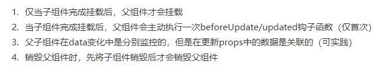
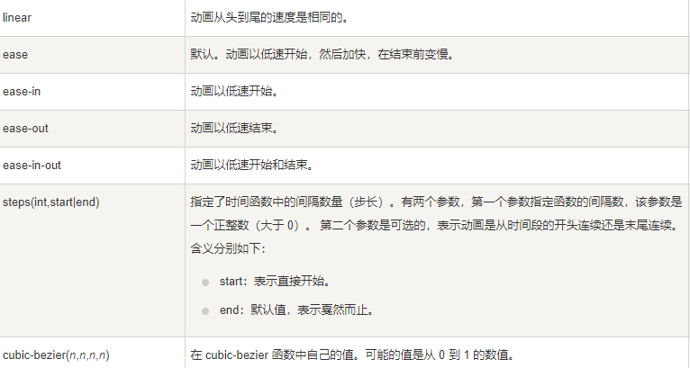

 

## TypeScript 

1. **静态类型**的好处
   - 杜绝手误导致的变量名写错。
   - 自动完成。
   - 重构支持。
   - 类型可以一定程度上充当文档
2. 编译选项

tsconfic里面放的是   编译器的配置

outfile 代码合成一个模块

outdir 用来指定编译后文件所在的目录./dist

module 指定模块化的规范

 lib  指定模块的类库

“inlude" 编译的目录

allowjs'  true 是否对js文件进行编译

checkjs  检查js代码是否符合语法的规范

removeComments ture 是否移除注释

noemit false 不生成编译的文件 

noemitoonerror false  有错误时不生成编译文件

 alawsstrict true      用来设置严格模式   use 

noimplicitany  不允许隐式的any的类型 手动指定any解决

strictnullchecks  在编译的时候如果有空的情况会报错

strict  严格检查的总开关   true   使代码更严谨

3. 使用webpack打包ts代码

对项目进行初始化 npm init -y

   npm i -D webpack webpack-cli typescript ts-loader

安装好四个包

​      const path =require("path")

module.exports= {

entry"指定入口的们见“

output:path.resolve(__dirname, "dis")

filename：js

}

module:{

rules:【写入规则】

test 指定的是规则生效的文件

use ‘ts-loader‘

}

#### js基础

||运算符解析。

```js
var a = obj || " " ;   //如果 obj 为空，a就赋值为 " " ； 默认值
```

#### gitee项目上传到远程仓库中

1. 打开项目文件夹gitbush一下  git clone +地址  项目里自动生成一个本地仓库文件 里面confic 文件可以设置配置 

2. 把项目放入本地仓库中       

3. 仓库文件中cmd  git add .  -> git commit -m "beizhu"   // 注意这里的是双引号如果是单引号不能有空格 -> git pull origin master -> git push -u origin master  结束 

   总结： 简单的操作流程是，新建文件夹用来放项目  git init  初始化项目  从远程克隆项目git clone 地址 ，第一次使用在.git 的confic里面配置相关 user 和 email   怎么将项目推到远程仓库？  先在我们的本地仓库操作 将文件里面的项目 放进本地仓库里面 git add .      然后提交 git commit -m  ’备注‘   拉到远程的主分支上面     git pull origin master  推送到远程的仓库的主分支上             注：  origin  是远程仓库的默认名字   ， ，  master 是主分支的名字       

    

#### git的使用

1. git branch 名字   创建分支
2. git checkout 名字  切换到分支上
3. git merge 名字  将..合并到主分支上
4. git clone 复制仓库
5. git fetch 获取远程的数据
6. git pull  先抓取再合并

#### 一个ts项目 贪吃蛇

1. package.json文件

```tsx
$ npm init
```

可以自动生成文件name  version  是必填的

`peerDependencies`字段，就是用来供插件指定其所需要的主工具的版本

bin项用来指定各个内部命令对应的可执行文件的位置

`main`字段指定了加载的入口文件，

`require('moduleName')`就会加载这个文件。这个字段的默认值是模块根目录下面的`index.js`。

配置文件  ：  用init自动生成

2. ##### package-lock.json 文件

当运行 `npm update` 时，`package-lock.json` 文件中的依赖的版本会被更新。

`package-lock.json` 会固化当前安装的每个软件包的版本，当运行 `npm install`时，`npm` 会使用这些确切的版本。

3. tsconfig.json

- 如果一个目录下存在一个`tsconfig.json`文件，那么它意味着这个目录是TypeScript项目的根目录。 `tsconfig.json`文件中指定了用来编译这个项目的根文件和编译选项
- `"files"`指定一个包含相对或绝对文件路径的列表。 `"include"`和`"exclude"`属性指定一个文件glob匹配模式列表

### 学习笔记

#### food类


 get  x 返回从左到右的距离

get y 是返回从上面到下面的距离

当按下一个键的时候就调用一个方法让蛇进行移动

```ts
init(){ document.addEventListener('keydown',this.keydownHandler.bind(this));
    this.run();
```


#### 取整

```ts
Math.round 四舍五入   abs 绝对值     ceil/floor  上/下取整  max min 取大小值  sqrt 开平方  pow 取幂 
Math.round(Math.random()*(m-n)+n): 获取n~m 之间的随机整数  PI：获取圆周率
```

#### 设置样式的属性值

```tsx
this.element.style.left = left + 'px'; 
```

#### 插入html


#### 类型断言（Type Assertion）

语法：值 as 类型   或   <类型>值  

告诉编译器具体的类型是什么

总结：

- 联合类型可以被断言为其中一个类型
- 父类可以被断言为子类
- 任何类型都可以被断言为 any
- any 可以被断言为任何类型

#### ts中变量的声明方式

```tsx
maxLevel: number;    score = 0;  
```

 格式是 **不带var let  const**    变量名字：变量的类型 后面可以赋值 也可以不赋值   不说变量的类型那么这个变量的类型就是any   

var和不var 的区别： 带var    在当前域中那么声明的就是这个域的局部变量 在外面的带var就是全局变量
  不带var 只是对属性赋值操作 

```markdown
HTMLElement   对象表示html中的一个元素 用dom方法获取
```

#### 修改开始标签和结束标签之间的html


innerhtml方法改两个标签之前的内容    可以拼串

<html id=myanchor>runoob </html>

后面跟属性名可以修改标签内的属性值

#### HTML DOM addEventListener() 方法


语法：

```js
document.addEventListener(*event*, *function*, *useCapture*)
```

三个参数：事件名称，方法，ture or false  代表的是是否捕获的时候执行方法 。

#### 定时器


需要传两个参数   代码执行一次    方法名，时间 ，时间不写默认立即开始   第三个可以给方法传参

- setTimeout之行前终止其运行就可以使用clearTimeout()。
- clearTimeout()用于重置js定时器，如果你希望阻止setTimeout的运行，就可以使用clearTimeout方法
- window.setInterval(调用函数, 延时时间);  反复的调用 这个方法
- 注意：就算设置为0秒 还是比window里的方法要慢

格式是  settimeout （（）=》{回调的函数 }，1000）   参数两个咯  第一个是回调函数  第二个是回调的间隔咯

#### querySelector和getelbyid  的区别

前者后面是要用  . #         

element.getElementsByTagName('标签名'); 父元素必须是                            指定的单个元素

```
getElementsByClassName 根据类名获得某些元素集合
```

```
 querySelector 返回指定选择器的第一个元素对象  切记 里面的选择器需要加符号 .box  #nav
```

```
querySelectorAll()返回指定选择器的所有元素对象集合
```

```
1.获取body 元素
var bodyEle = document.body;
```

```
2.获取html 元素
// var htmlEle = document.html;
var htmlEle = document.documentElement;
```


#### 事件的三要素

```js
// 1. 事件是有三部分组成  事件源  事件类型  事件处理程序   我们也称为事件三要素
//(1) 事件源 事件被触发的对象   谁（任意对象）  按钮
var btn = document.getElementById('btn');
//(2) 事件类型  如何触发 什么事件 比如鼠标点击(onclick) 还是鼠标经过 还是键盘按下
//(3) 事件处理程序  通过一个函数赋值的方式 完成
btn.onclick = function() {
    alert('点秋香');
}  过程：获取事件源，绑定事件，添加事件处理方法
```

#### innerhtml 和text 的区别

** innerHTML指的是*从对象的起始位置到终止位置的全部内容,包括Html标签。
**  innerText指的是从起始位置到终止位置的内容,但它去除Html标签。

#### 修改元素的属性

```
描述：设置元素的【属性】
    语法：元素名.setAttribute('属性','属性值');
```

```
描述：获取属性值
    语法：元素名.getAttribute('属性名')；
```

```
描述：删除一个属性
    语法：元素名.removeAttribute('属性名');
```

```
 2.1.1获取css样式
   语法：元素名.style.样式名   直接得到
```

```
 2.1.2设置css样式
    语法：元素名.style.样式名="属性描述"  为空的时候就是清除的意思直接写null也行
```

```txt
注意：
       1.只能操作行内样式
       2.当设置的样式含有单位时 则必须+单位
       3.如果样式是js中的关键字 则需要在样式前+css
       4.如果样式由下划线连接 则需要去掉下划线将后面的单词首字母变为大写
```

```
4.1设置样式
    语法：通过元素名.style.setProperty();
    例子：
       box.style.setProperty('background-color','red');
       box.style.setProperty('height','100px');
4.2获取样式值
    语法：元素名.style.getPropertyValue('样式名')
      console.log(box.style.getPropertyValue('width'));
4.3清除样式
   语法：元素名.style.removeProperty('样式名');
     box.style.removeProperty('height');
```

```
1.1setAttribute('属性名'，'属性值')
    描述：关联内部样式
    语法：setAttribute('属性名'，'属性值');
     注意：
       1.可以追加自定义属性的
         div.setAttribute('a','box');
       2.多次对一个属性设置值 则最后一次生效
         var div = document.querySelector('div');
         div.setAttribute('class','a');
         div.setAttribute('class','box');
 1.2removeAttribute  删除【属性】
     div.removeAttribute('class');
    例子：
         var div = document.querySelector('div');
         div.setAttribute('class','a');
         div.setAttribute('class','box');
         div.removeAttribute('class');

```

```
1 className      React标签中这样写
   描述：设置元素的类及其值
   语法：元素名.className
   例子：
       var div = document.querySelector('div');
       div.className = 'box';
   注意：当一个属性多次被赋值则最后一次赋值有效
       div.className = 'a';
       div.className = 'box';//有效

2清除类名
    div.className='';

```

#### 属性的增删改

原版的方式：element.属性= '值'  修改  class特殊点变成className     不支持自定义

用啊球biu特     支持自定义属性

```js
element.setAttribute('属性', '值'); 
```

getAttribute()   setAttribute()  removeAttribute()

#### H5自定义属性

```js
dataset 是一个集合里面存放了所有以data开头的自定义属性
```

获取方式是emlement.dataset     属性的命名方式是data-后面连接名字    获取data只需要写data后面的

如果自定义属性里面有多个-链接的单词，我们获取的时候采取 驼峰命名法

#### console.dir()的使用

dirxml可以打印出div本身和标签内的节点元素 用于节点问题

16. 节点相关

elelment.parentNode     获取最近的父节点 ，

elelment.childNodes   获取所有的子节点  标签和标签内的内容也读  

ul.children  获取的是ul里面的子元素节点  只读标签

**元素节点的nodeType属性值是1。**
**属性节点的nodeType属性值是2。**
**文本节点的nodeType属性值是3。**

#### 克隆节点

```
// 1. node.cloneNode(); 括号为空或者里面是false 浅拷贝 只复制标签不复制里面的内容
// 2. node.cloneNode(true); 括号为true 深拷贝 复制标签复制里面的内容
```

innerHtml的拼接效率数组的形式最高

#### 注册事件

有两种方式可以注册事件   1. 元素.事件名=function(){   } 2.

```js
btns[1].addEventListener('click', function() 
```

attachevent  在ie9之前也可以注册事件现在用的少 

#### 删除事件 

传统的方式删除直接=null    元素.事件名=null；

```js
divs[0].onclick = null;
```

```js
divs[1].removeEventListener('click', fn);
```

```js
divs[2].detachEvent('onclick', fn1);
```

fn指的是要删除的函数名字   参数第三个可以传 *useCapture* 默认是等于false  在冒泡的时候删除或者true是在捕获的地方。

#### 事件对象

```js
// 1. event 就是一个事件对象 写到我们侦听函数的 小括号里面 当形参来看
// 2. 事件对象只有有了事件才会存在，它是系统给我们自动创建的，不需要我们传递参数
// 3. 事件对象 是 我们事件的一系列相关数据的集合 跟事件相关的 比如鼠标点击里面就包含了鼠标的相关信息，鼠标坐标啊，如果是键盘事件里面就包含的键盘事件的信息 比如 判断用户按下了那个键
// 4. 这个事件对象我们可以自己命名 比如 event 、 evt、 e
// 5. 事件对象也有兼容性问题 ie678 通过 window.event 兼容性的写法  e = e || window.event;
```

```
event.target.nodeName 　　//获取事件触发元素标签名（li，p，div，img，button…）
event.target.id　　　　　　//获取事件触发元素id
event.target.className　　//获取事件触发元素classname
event.target.innerHTML　 //获取事件触发元素的内容（li）
```

e.target 点击的对象              this和currentTarget  指向的就是调用者  调用方法的对象   

#### getBoundingClientRect

```js
let elLeft = event.target.getBoundingClientRect().left;
```

- top: 元素上边距离页面上边的距离
- left: 元素右边距离页面左边的距离
- right: 元素右边距离页面左边的距离
- bottom: 元素下边距离页面上边的距离
- width: 元素宽度
- height: 元素高度 

#### 事件对象阻止默认行为的方法

默认行为就是一个事件触发了不是方法内的是**本身标签就特有的方法**  只需要在方法体内 return false 就可以让默认事件不发生   或者e.preventDefault();     事件修饰符

#### 阻止事件冒泡

```js
e.stopPropagation(); // stop 停止  Propagation 传播
e.cancelBubble = true; // 非标准 cancel 取消 bubble 泡泡
```

#### 事件委托

在一个标签下很多子标签的情况下 我们只需要注册一个父元素的监听器  然后利用e.target 是指的的点击的元素  让单个元素发生变化

```js
var ul = document.querySelector('ul');
ul.addEventListener('click', function(e) {
    // alert('知否知否，点我应有弹框在手！');
    // e.target 这个可以得到我们点击的对象
    e.target.style.backgroundColor = 'pink';
    //将点击的对象设为pink
})   ul内存在很多li标签
```

#### 鼠标事件对象   获取鼠标点击的坐标方法

```js
document.addEventListener('click', function(e) {
    // 1. client 鼠标在可视区的x和y坐标
    console.log(e.clientX);
    console.log(e.clientY);
    console.log('---------------------');
    // 2. page 鼠标在页面文档的x和y坐标
    console.log(e.pageX);
    console.log(e.pageY);
    console.log('---------------------');
    // 3. screen 鼠标在电脑屏幕的x和y坐标
    console.log(e.screenX);
    console.log(e.screenY);
})
```

#### 跟随鼠标的图标

```js
var pic = document.querySelector('img');
document.addEventListener('mousemove', function(e) {
    // 1. mousemove只要我们鼠标移动1px 就会触发这个事件
    // console.log(1);
    // 2.核心原理： 每次鼠标移动，我们都会获得最新的鼠标坐标， 把这个x和y坐标做为图片的top和left 值就可以移动图片
    var x = e.pageX;
    var y = e.pageY;
    console.log('x坐标是' + x, 'y坐标是' + y);
    //3 . 千万不要忘记给left 和top 添加px 单位
    pic.style.left = x - 50 + 'px';
    pic.style.top = y - 40 + 'px';
```

#### location

```js
// 记录浏览历史，所以可以实现后退功能
// location.assign('http://www.itcast.cn');
// 不记录浏览历史，所以不可以实现后退功能
// location.replace('http://www.itcast.cn');
```

```js
location.href = 'http://www.baidu.cn';
//给事件源绑定页面跳转
```

#### offset系列

```js
// offset 系列
var father = document.querySelector('.father');
var son = document.querySelector('.son');
// 1.可以得到元素的偏移 位置 返回的不带单位的数值  
console.log(father.offsetTop);
console.log(father.offsetLeft);
// 它以带有定位的父亲为准  如果么有父亲或者父亲没有定位 则以 body 为准
console.log(son.offsetLeft);
var w = document.querySelector('.w');
// 2.可以得到元素的大小 宽度和高度 是包含padding + border + width 
console.log(w.offsetWidth);
console.log(w.offsetHeight);
// 3. 返回带有定位的父亲 否则返回的是body
console.log(son.offsetParent); // 返回带有定位的父亲 否则返回的是body
console.log(son.parentNode); // 返回父亲 是最近一级的父亲 亲爸爸 不管父亲有没有定位
```

```js
// offset与style的区别  
console.log(box.offsetWidth);  //无单位
console.log(box.style.width);  //有单位
```

#### 计算鼠标在盒子里面的坐标

```js
// 我们在盒子内点击， 想要得到鼠标距离盒子左右的距离。
// 首先得到鼠标在页面中的坐标（ e.pageX, e.pageY）
// 其次得到盒子在页面中的距离(box.offsetLeft, box.offsetTop)
// 用鼠标距离页面的坐标减去盒子在页面中的距离， 得到 鼠标在盒子内的坐标
var box = document.querySelector('.box');
box.addEventListener('mousemove', function(e) {
    // console.log(e.pageX);
    // console.log(e.pageY);
    // console.log(box.offsetLeft);
    var x = e.pageX - this.offsetLeft;
    var y = e.pageY - this.offsetTop;
    this.innerHTML = 'x坐标是' + x + ' y坐标是' + y;
})   
```

#### mouseenter和mouseover的区别

不论鼠标指针穿过被选元素或其子元素，都会触发 mouseover 事件。

只有在鼠标指针穿过被选元素时，才会触发 mouseenter 事件。

#### 学习程序

1. 要求：


2. 多线程学习


3. 如何深入的学习


#### 六顶思考帽子

- 蓝帽，开始，给出问题，给出标准。

- 绿帽，开始无约束地做发散思维，开始胡扯。

- 白帽，给出现有数据。

- 红帽，给出一个直接判断，与个人意向。

- 黄帽，评估优势。

- 黑帽，评估劣势。

- 蓝帽，决策。

  整个流程可以是嵌套反复的

#### 操作

多行复制多行操作 ：Ctrl键配合使用

替换                          ：ALT+R

32. unshift()和push方法

前者是将元素加在数组的前面，后者是将元素加在数组的后面

```js
var fruits = ["Banana", "Orange", "Apple", "Mango"];
fruits.unshift("Lemon","Pineapple");
```

## 数组相关

#### 排序

假设有一个包含学生名字和年级的列表，已经将它按学生名字字母顺序进行预排序：

```js
const students = [
  { name: "Alex",   grade: 15 },
  { name: "Devlin", grade: 15 },
  { name: "Eagle",  grade: 13 },
  { name: "Sam",    grade: 14 },
];
```

对这个数组执行 `grade` 升序排序后：

```js
students.sort((firstItem, secondItem) => firstItem.grade - secondItem.grade);
```

   总结：利用sort方法里面传数组里两个比较的元素，
升序前减后 ；降序后减前

#### 数组API

**`splice()`** 方法通过删除或替换现有元素或者原地添加新的元素来修改数组,并以数组形式返回被修改的内容。此方法会改变原数组。

  总结：传入三个参数 **start**开始的索引 **deleteCount**删除的个数  **item1**后面要添加的数组从start位置开始

`**find()**` 方法返回数组中满足提供的测试函数的第一个元素的值。否则返回 [`undefined`](https://developer.mozilla.org/zh-CN/docs/Web/JavaScript/Reference/Global_Objects/undefined)。

```
const array1 = [5, 12, 8, 130, 44];
const found = array1.find(element => element > 10);
console.log(found);    // 找到数组中第一个大于10 的s
```

**reduce**：触发      回调函数        返回的是回调函数     处理后的     结果  

```javascript
const  a =[1,2,3]
const reducer= (pre ,cur)=>pre+cur;
console.log(a.reduce(reducer));
```


#### Vue.set()和this.$set()介绍、

区别在于Vue.set()是将set函数绑定在Vue构造函数上，this.$set()是将set函数绑定在Vue原型上。

set函数接收三个参数分别为 target、key、val，其中target的值为数组或者对象，这正好和官网给出的调用Vue.set()方法时传入的参数参数对应上。

```js
this.$set(this.student,'sex','男')  
```

#### 过滤Array.prototype.filter()

```jsjsx
let nums = [1, 2, 3, 4, 5, 6, 7, 8, 9, 10];
let res = nums.filter((num) => {
  return num > 5;
});
console.log(res);  // [6, 7, 8, 9, 10]
```

```js
this.student.hobby = {this.student.hobby.filter((h)=>{
   return h !== '抽烟'
```

  总结：利用箭头函数h代表需要过滤的数组对象，后面可以返回符合过滤条件的数组

#### 内置指令   优化

v-text   将里面的内容全部替换

v-html  替换html里面的全部内容只要是html里面的标签都可以使用

v-clock  本质是一个特殊属性，Vue实例创建完毕并接管容器后，会删掉v-cloak属性。解决网速慢的问题

v-once   所在节点在初次动态渲染后，就视为静态内容了。

v-pre  放在一些不需要vue来编译的可以加快速度

#### 修改mysql数据库的密码

```mysql
ALTER USER 'root'@'localhost' IDENTIFIED BY '123456';
```

#### 请求不到数据的情况

```js
const { data: res } = await this.$http.delete(`goods/${id}`)
```

这里的url         后面不是用单引号 是用   ---------   **反引号**     **模板字符串**

#### token登陆原理

1. 

总结：请求登入之后服务器给客户端一个token便于下次不用再次请求登陆

#### 前端项目初始化

1. 


#### 后端项目环境安装配置

1. 

#### 操作

1. npm install安装依赖项
2. npm run serve  和 控制台输入 vue ui 是一样的启动的是脚手架

#### 遇到的问题

1. No ESLint configuration found       ESLint  没有安装

解决方案是：安装   npm i eslint -g   生成配置i文件eslint --init

#### 什么是ESLint？ 如何使用特点 配置相关

1. ESLint 是一个用来识别 ECMAScript/JavaScript 并且按照规则给出报告的代码检测工具。

   总结：ESLint 就是一个工具，而且是一个用来检查代码的工具。

2. 初始化

```js
# 全局安装 ESLint
$ npm install -g eslint
# 进入项目
$ cd ~/Code/ESLint-demo
# 初始化 package.json
$ npm init -f
# 初始化 ESLint 配置
$ eslint --init
```

总结：..

3. ESlint的特点

- 内置规则和自定义规则共用一套规则 API。
- 内置的格式化方法和自定义的格式化方法共用一套格式化 API。
- 额外的规则和格式化方法能够在运行时指定。
- 规则和对应的格式化方法并不强制捆绑使用。
- 每条规则都是各自独立的，可以根据项目情况选择开启或关闭。
- 用户可以将结果设置成警告或者错误。
- ESLint 并不推荐任何编码风格，规则是自由的。
- 所有内置规则都是泛化的。

#### bable是什么？ 

是把高级的es6转化成es5的工具 

### 登入页面

1. #### ：model=“data数据”   最外层的

 v-model =”data数据里面的某个属性值

```js
model="loginForm.username"
```

```js
prefix-icon="el-icon-lock"       放在input前面的锁图标
```

2. #### 用于表单输入框的前面的图标属性

```js
:loading="loginLoading"
```

3. #### e-button里面的是否加载属性  在data里面
4. #### 表单的验证规则

```js
:rules="loginFormRules"
```

#### 最外层绑定规则

```js
el-form-item prop="username"           父给子传的prop
```

#### 在每个输入表单中定义prop

```js
loginFormRules: {
  username: [
    {
      required: true,  
      message: '请输入登录名称',
      trigger: 'blur'
    },
```

在data里面定义

5. #### 表单重置

| resetFields | 对整个表单进行重置，将所有字段值重置为初始值并移除校验结果 |
| ----------- | ---------------------------------------------------------- |
|             |                                                            |

ref是resetFields的缩写

```js
ref="loginFormRef"   //在组件的this中发现￥refs的属性值和这个一样
```


我们为重置按钮绑定单机事件

```js
<el-button type="info" @click="resetLoginForm">重置</el-button>
```

在data后面我们methods中定义方法

```js
this.$refs.loginFormRef.resetFields()
```

refs可以调用这个方法

ref是整个表单的引用

6. #### 表单的预验证

| validate | 对整个表单进行校验的方法，参数为一个回调函数。该回调函数会在校验结束后被调用，并传入两个参数：是否校验成功和未通过校验的字段。若不传入回调函数，则会返回一个 promise | Function(callback: Function(boolean, object)) |
| -------- | ------------------------------------------------------------ | --------------------------------------------- |
|          |                                                              |                                               |

拿到ref的引用之后可以进行表单预验证 回调第一个是验证的布尔值

争对布尔值进行一个函数校验

7. #### 向服务器发起请求校验

```js
const { data: res } = await this.$http.post('login', this.loginForm)
```

解构，发起post请求        res.meta.status 服务器返回的状态码

改变加载状态   之后 我们会弹出一个对应的message 

```js
return this.$message.error('登录失败 帐号或密码错误!')
```

```js
Vue.prototype.$message = Message  //原型对象里面定义一个message这个message是element ui 的一个message包  注册下来
```

8. #### 退出功能

```js
window.sessionStorage.clear()
this.$router.push('/login')
```

两个东西就是将token删除之后通过路由跳转到登入页面

9. #### 获取全部的菜单在左侧栏

在creat函数里调用获取全部菜单的方法

this.getMeuList      在data里存储meulist 的数组用于存放菜单数据

```js
async getMenuList() {
  const { data: res } = await this.$http.get('/menus')
  if (res.meta.status !== 200) return this.$message.error(res.meta.msg)
  this.$message.success(res.meta.msg)
  res.data.unshift(this.welcome)
  this.menuList = res.data
  console.log(res, 'menus')
},
```

请求服务器获取菜单数据 ，将得到的数据结构赋值到data中去

10. #### 循环渲染菜单

将数值转化成字符串的方式在后面加一个空串

在一级菜单里面 需要动态的绑定 index  用来特定的表示他的打开状态

v-for ="item for  menuList"   用来将item表示每个一级菜单的子元素的item方便从数组中取出数据     ：key  =”item.id"    

11. #### 利用阿里的图标库自定义菜单的图标

首先是一个fonts的文件放在assets静态资源文件夹里面

在main,js入口文件导入incofont包 import './assets/fonts/iconfont.css'

主要是css文件    动态绑定class 

12. #### 路由占位符

占位符的作用是：路由规则匹配到的组件,将会被渲染到 router-view 所在的位置

13. #### 实现二级菜单点击高亮的一个效果

首先在每个二级菜单e-menu 里面 有一个属性是defalut active  类型是是tiring类型将点击的菜单的path 存在在本地撒宣死多瑞里面

14. #### 常用的面包屑 

我们直接把面包屑给重新弄成一个自定义组件，对elemnet ui 的原生组件的改造 

15. #### 作用域插槽是什么 

属于是组件间的通信了，通过作用域插槽我们可以实现，将子组件的数据插入到父组件利用

组件类比于标签要想在标签内部插入一些变量值那就要用slot  <div>在这内部需要插入</div>  :用于将变量插入   不用分号是直接插入

在组件：标签中插入一些数据必须要用<template> 框起来

eg. 

在data里面配置pros  值键对的形式       btnStyle ： primary   我可以是原始 的  然后在使用这个组件的时候   

这时得到是一个橙色的按钮在利用作用域插槽的组件的时候
在标签的属性内 写一些配置  

16. #### Home里面的侧边栏的实现

    ```js
    <el-aside :width="isCollapse ? '61px' : '200px'">
    ```

    

在侧边栏e-aside里面动态绑定一个:width属性用三元运算符我们根据 isCollapse的状态值我们可以改改变下面侧边栏e-meun菜单的属性值 collapse 是否折叠这个菜单


每个菜单有一个唯一的标识：index 动态绑定在最外层    default-active 是激活的那个index 值被点击的那个菜单  

17. #### 添加用户

1. 对话框

```js
:visible.sync="editDialogVisble"  <e-dialog>
```

这个属性是修改用户信息对话框的属性 监听对话框的开启的状态  在开的时候显示出来在关时候会隐藏起来

```js
<el-button @click="editDialogVisble = false">取 消</el-button>
```

点击取消按钮之后会将这个属性值设为默认的falase   就是不显示出来

  包括修改页面的实现也是一样

```js
<el-button slot="append" icon="el-icon-search" @click="getUserList"></elbutton>
```

这里slot的属性是	append是放在紧贴在依赖组件的后面  prepend 是放在前面  一般都是放在后面

##### layout  标签  

```js
<el-row : gutter="20">       el-col :span="7"
   ：gutter是 栅格间隔      ：span 栅格占据的列数 
```

Row 组件 提供 `gutter` 属性来指定每一栏之间的间隔，默认间隔为 0。

row是一行   一行里面有列    e-col    :span是列的长度  

18. #### 用户列表

tale-column   类型有三种 selection多选框  index 序号  expand  可以展开

搞懂了v-slot=“scope”   scope.row 就是动态的渲染每一行的数据{{scope.rwo}}    打印一下scope.row知道了。 

​                                                                                  动态的渲染了一些数据、

19. #### npm整合在vue中

在包配置文件里面scipt放的是一些插件  默认是vue ui里面就自带的插件

```js
Vue.component('tree-table', TreeTable)
```

在使用第三方的npm组件包首先我们要去包的描述文件里面配置一下下载的组件包在依赖里面配置好 dev依赖也需要配置   == 》  我们可以在main.js入口文件里面   按上图全局使用vue的组件 前面是标签名后面是组件的实名

20. #### vue.config.js是可选的配置文件

他的作用很大在利用vuecli创建的项目中我们可以在此文件中配置webpack包管理器的相关配置


```js
module.exports = {
  configureWebpack: {
    resolve: {
      alias: {
        assets: '@/assets',
        common: '@/common',
        components: '@/components',
        views: '@/views',
        network: '@/network'
      }
    }
  },
```

webpack是可以文件包的别名

21. #### cookie、localStorage 和 sessionStorage的区别


1.  token是后端传送过来的一段带签名加密的字符串，发送到浏览器存储cookie，浏览器访问携带token访问，可以实现单点登录，而且防止伪造信息，因为签名无法被破解

2. cookie不设置有效期那么和sessionstorage是一样在窗口关闭的时候就会自动消除

   ```js
    Response.Cookies(“LastView”).Expires = #2003/1/29 21:00:00#
   ```

   21:00:00  可以不设置  如果不设置默认是当天的凌晨12点

#### 函数中的this

在对象里面：

如果函数是对象的方法（属性）这里的this 是当前的对象，

如果只是一个普通的函数那么this是代表全局window，

#### 


## VUE 3.0


到了vue3之后我们的element ui 就没有用了 所以我们要安装element plus

生命周期：增加了`setup`函数。其他周期函数基本就是命名上在vue2.x的基础上加上`on`前缀，以驼峰命名方式命名，要写到setup函数里面

vue3里面可以没有根标签《div.>

#### 项目结构是怎么样的？

public公共资源   dist 打包之后得到的目录    index.html 首页的入口 这里面可以加一些浏览器相关的meta 啥的。config 是一些配置文件包括一些端口号

| src          | 这里是我们要开发的目录，基本上要做的事情都在这个目录里。里面包含了几个目录及文件：assets: 放置一些图片，如logo等。components: 目录里面放了一个组件文件，可以不用。App.vue: 项目入口文件，我们也可以直接将组件写这里，而不使用 components 目录。main.js: 项目的核心文件。index.css: 样式文件。hooks文件 ：是对一些模块方法的抽离  store文件：Store 文件夹放置你的 Vuex 相关文件  有这些：state 、 actions 、 mutations 、 getters， |
| ------------ | ------------------------------------------------------------ |
| node_modules | npm install 按照依赖下载的模块全放在这里面                   |

路由和view有关系  因为我做todolist没有使用的路由 。所以这里先省略

#### 组合式api    vuex状态管理

1. 可以通过调用 `useStore` 函数，来在 `setup` 钩子函数中访问 store。这与在组件中使用选项式 API 访问 `this.$store` 是等效的。

访问的是store 得到的也是**store 的实例** 实例中有的一些**方法**commit、getters 、dispatch

2. vuestore 里面的存储方法

dispatch  和     commit 两个方法可以实现数据的修改 参数：1.方法名字和2.要修改的值。。    前者异步的后者是同步的。

useStore 函数就是为了得到store 的实例   我们把他直接给一个值 const a = useStore（）；

好的那么可以 a就是store实例了。    相当于this.$store    

#### 分析工程项目

在vue3可以写data和method 但是 vue2可以读取到vue3配置数据和方法

但是vue3不可以读取到vue2的数据和方法            **向上兼容的**


返回一个对象（推荐），或者返回一个渲染的函数。 vue3向上兼容但是不向下兼容

在vue2可以读取到vue3的数据 vue3读取不到vue2的数据 。


async 不可以加载setup里面因为一加里**必须是要返回一个promise** 才能拿到 导致渲染不上到网页上。

#### setup

1. ref   ref 在vue3中是一个函数  

在setup中我们定义一个数据应该是以**返回值的形式**来定义要不然数据做出了修改页面上也不会发生改变  let name  =ref（'张三 '） 这样的数据才能被渲染到页面上  

**普通数据类型:**

但是我们要改的并且渲染到页面上那就要 name.value 他里面原型会通过get set 方法去修改原型的值 实现真正的修改 。 但是在模板里面是不用.value 的。  实现原理：   object.defineProperty的get set  

**对象类型**

变成了**proxy**类型了，  reactive 函数   也就是说如果我定义的数据类型是一个对象的话那么我 应该  let job = **reactvie**（{  巴拉巴拉}） 然后引用的方法是什么都不用，**不用去点value**了 直接一层层的点到要操作的数据  也可以操作数组的类型可以直接修改

通过**代理对象，数据劫持**。

#### vue3中的数据劫持

**reflect** 反射 本身会返回一个**布尔值** ，说明他成功没成功  可以通过if判断 ，但是object.denfinproperxy 没有布尔值需要利用try catch   

js中的object 将来会搬运到reflect 中去 。

vue3 中是proxy 代理对象 可以监视数据的增删改查 。通过reflect 来修改原型内部的属性

```js
Object.defineProperty
 第一个参数是操作的对象   第二个参数是操作对象的属性   第三个是通过get set 方法对数据的修改 读取 。
```

#### vue3 两个注意点 

**vue2**

this 是常用的。 

1. $attr 是**捡漏**的  我们在**prop**是没有声明的会出现在$attr 中
2. $**slot**   **template 里面slot** 属性  等于是在父组件标签**<template>**中挖坑 ，子组件的中去定义这个插槽

**vue3**

setup在beforeCreat 之前就执行一次 。  在vue3中使用v-slot ：名字   剧名插槽。

一些参数 :

1. props  :  值为对象的形式 ，  包含着外部传过来的值 ，最后都要return 出去的。

2. context  :上下文。     attrs  ：  如果在props对象中没有声明的话 this.$attrs

   中可以找到。     slots:  用于接受插槽的内容  相当于是 this.$slots   emit :  分发自定义事件的函数  相当于是  this.$emit  

#### watch  

可以监视data或者setup里面的值   vue2的普通写法  watch：{  值名字 （newvalue，oldvalue）{ （new ，old。）log	可以得到两个参数 

这是写成方法的形式 ， 还可以写成是一个对象的形式 

```js
watch：{
sum:{
  deep: true, //深度监视
  immediate: true, //一开始就监视一下
  handler(nv,ov){   可以做一些相关的配置，在hanle函数里面取到新旧值。
      console.log('sum的值发生变化了');
      console.log(`newValue:${nv}, oldValue:${ov}`);
                }}
```

如果要监视两个数据的变化 我们在vue3中可以写两个watch 的配置项， 但是在vue2中是不可以写两个配置向导   

在vue3中有渐变的写法 ，可以吧监听的数据放在一个数组里面  

vue 的watch 可以传第三个参数 就是他的配置项  immdiate：true

如果ref里面传的还是对象的话 但是vue中还是会走reative的逻辑

**vue3坑**

1. 在reative中 的watch 不能监视到 old value             **一个坑**    平常是不需要old的

如果真的需要监视到那个旧值我们把他放在ref中。**默认开始是深度监视而且是关不掉的**

2. 只能监视到 对象 普通数据类型，数组 ， watch的第一个参数只能是这些，不能是对象的属性  ， 解决方案 ： 写成一个**函数**的形式 ，（）**=》**person.name  直接返回的是对象的属性。  可以把函数写在数组中实现多个属性的监听 。
3. deep有没有效果完全是看watch 的第一个参数  监视的是什么类型   如果是对象默认会开启深度监视 ， 如果是函数返回对象的某一个属性 deep配置true生效 。

#### watch 监听ref数据点不点value  

要明白自己监听的到底是哪个函数，ref 也可以监听但是他走的还是reative的逻辑 ， 要深度的监听到事件我们可以给watch 第三个参数传deep：true  或者是 第一个参数给到person.value   /... 

#### watchEffect

默认**立即监视 用谁监视谁** 。。。  不用指明监视哪个属性，有点像computed    初始化变化一次所用到的数据会变一次  。 **computed是返回值**，  **watchEffect 是返回函数** 注重的是过程 。 。

vue3中mount 和unmount 两个   

#### 自定义hook函数   

把**组合式api进行封装** 

hooks封装在js文件里面一般是函数的形式这个函数要有**返回值** ， 才能在组件里面使用 

let ponit =fn（）；  得到函数的返回值   模板内可以使用 。外部的方法可以引用。

组合api  只要是setup里面写的都是组合api    类似于vue2.x的**mixin**   

优势 :  复用代码  让setup更清晰易懂

#### torefs

可以在setup 的retrun 里面 直接返回ref 的数据 name：ref（用点访问到需要的数据）

但是这样是没有改变实际的值 可以在页面中显示  。

torefs可以将一个对象的所有属性都变成ref 响应式的 数据 

在一个对象里面我要返回多个对象，需要使用到...运算符爆炸开来，torefs（person）把person对象的全部属性变成响应式的    只能爆炸到第一层不会炸到第二层 

torefs将对象变成 ref对象 。。。批量变成ref对象 

#### 其他的api   

**shallowreactive**： 只处理最外层的响应式属性

**shallowref**： 只处理基本响应数据类型  不进行对象处理 

#### 生命周期 

```js
setup()     相当于beforeCreate()	 和created()
```

可以直接在里面写函数


。。。。。。。。。。。。。。。。。。。。。。。。。。。。。。。。。。。。。。待

## VUE  相关 

#### v-clock

当网络较慢，网页还在加载 Vue.js ，而导致 Vue 来不及渲染，这时页面就会显示出 Vue 源代码

我们可以使用这个来防止他闪烁       渲染成功之后这个会自动从html元素下市删去

```js
[v-cloak]{
  display: none;
}
```

#### v-pre

就是不编译了 ，让插值语法没有作用显示原来的东西  他的子元素也没有用

#### v-text

```html
<span v-text="msg"></span>
<!-- 等价于 -->
<span>{{msg}}</span>
```

相当于是插值语法   在span里面 text里面插入一些数据 

#### v-html

不要在网上渲染一些用户提交的内容在html里面导致xss攻击

```html
<div v-html="html"></div>    预期：string
```

在标签内容加东西 

####  v-show

 是条件渲染 和v-if 对比                **根据表达式的真假值** 

```js
<div v-html="1231321" v-show="false">    
    <div v-html="1231321" v-if="false">   
```

显示是display =none   不管布尔值是什么v-show都会渲染html 只是改变了css的样式属性

#### v-for 

和`v-if` 一起使用的时候前者的优先级 更高

```  html
<div v-for="(item,index) in a "  :key=“i”>
  {{item}}   ------   {{index}}
</div>     item是这个a里面的元素    index是下标 ，设为key不设就报错
<div v-for="(item,index) of a "  :key=“i”>
  {{item}}   ------   {{index}}
</div>     // 这种是支持迭代器的遍历
```

搞清楚一个问题就是item是数组里面的元素    后面的i就是他的下表   这两个名字都是可以修改的    利用:key 缩写key属性只能使用**number或String**


#### v-on

缩写 ：@event  ="Function | Inline Statement | Object"  事件绑定  

```html
<button @[event]="doThis"></button>    
```

绑定动态事件   

```html
<button @click.prevent="doThis"></button>
```

阻止默认行为 

#### v-bind

缩写是  :    v-model 是双向绑定

#### props:  父给子传值

因为：`props`是子组件访问父组件数据的唯一接口

使用props 传递数据，父亲向儿子传递数据

分辨父子 ： 在组件内利用import 导入子组件的是父组件  

```js
import ratingStar from 'src/components/common/ratingStar'  // 往组件里面导子组件
 components: { ratingStar}  //  在vue实例中注册子组件 
```

子组件内：

```js
props:['rating'],  // 在vue中声明一下值
```

注： **data、props、computed**

例子：

```js
<section class="head_goback" v-if="goBack" @click="$router.go(-1)">
    <svg width="100%" height="100%" xmlns="http://www.w3.org/2000/svg" version="1.1">
        <polyline points="12,18 4,9 12,0" style="fill:none;stroke:rgb(255,255,255);stroke-width:2"/>
    </svg>
</section>
```

goback 是属性 父给子传，这里绑定在v-if 方便父组件，利用。

```js
props: ['signinUp', 'headTitle', 'goBack'],
```


####  event ： 通过事件的方式  子给父传值

在子组件里面：

```js
  methods:{
    changeTitle() {
      this.$emit("titleChanged","我给爸爸传的值");//自定义事件  传递值“子向父组件传值”
    }
```

在父组件里面：

在子组件里面已经自定义了一个事件名titleChanged  我们要在父组件里面实现这个事件

```js
<app-header v-on:titleChanged="updateTitle" ></app-header>
```

爸爸要知道儿子要给他一个值 就要在data里面记下来，儿子要给我传值了  

```js
data(){    return{      title:"我给爸爸传的值"    }
       updateTitle（e）{this.title=e;}
```

**总结：子组件通过events给父组件发送消息，实际上就是子组件把自己的数据发送到父组件 ** 不属于自定义指令（v-on）里面的应该是**自定义的v-on 的方法**这样说才对。

一般看到**emit** 一般就是要绑在**v-on** 的指令的方法了。 

ts写法：

```js
const removeTodo = (id: number): void => {
  emit('removeTodo', id);
}  // 函数名是removeTodo 参数是id 是数字类型的 方法一个回调就是去调用removetodo方法 传的还是id   子组件给父组件的v-on 传一个方法。
```

#### directives  :  自定义指令

- `bind`: 只调用一次，指令第一次绑定到元素时调用，用这个钩子函数可以定义一个在绑定时执行一次的初始化动作。

- `inserted`: 被绑定元素插入父节点时调用（父节点存在即可调用，不必存在于 document 中）。

- `update`: 被绑定元素所在的模板更新时调用，而不论绑定值是否变化。通过比较更新前后的绑定值，可以忽略不必要的模板更新（详细的钩子函数参数见下）。

- `componentUpdated`: 被绑定元素所在模板完成一次更新周期时调用。

- `unbind`: 只调用一次， 指令与元素解绑时调用。

- ##### 钩子函数参数

  钩子函数的参数有：

  - **el**: 指令所绑定的元素，可以用来直接操作 DOM 。

  - binding

    : 一个对象，包含以下属性：

    - **name**: 指令名，不包括 `v-` 前缀。
    - **value**: 指令的绑定值， 例如： `v-my-directive="1 + 1"`, value 的值是 `2`。
    - **oldValue**: 指令绑定的前一个值，仅在 `update` 和 `componentUpdated` 钩子中可用。无论值是否改变都可用。
    - **expression**: 绑定值的表达式或变量名。 例如 `v-my-directive="1 + 1"` ， expression 的值是 `"1 + 1"`。
    - **arg**: 传给指令的参数。例如 `v-my-directive:foo`， arg 的值是 `"foo"`。
    - **modifiers**: 一个包含修饰符的对象。 例如： `v-my-directive.foo.bar`, 修饰符对象 modifiers 的值是 `{ foo: true, bar: true }`。

  - **vnode**: Vue 编译生成的虚拟节点。

  - **oldVnode**: 上一个虚拟节点，仅在 `update` 和 `componentUpdated` 钩子中可用。

#### 不同版本的Vue

```JS
关于不同版本的Vue：
   1.vue.js与vue.runtime.xxx.js的区别：
         (1).vue.js是完整版的Vue，包含：核心功能+模板解析器。
         (2).vue.runtime.xxx.js是运行版的Vue，只包含：核心功能；没有模板解析器。
   2.因为vue.runtime.xxx.js没有模板解析器，所以不能使用template配置项，需要使用
      render函数接收到的createElement函数去指定具体内容。
```

#### vue.config.js配置文件

1. 使用vue inspect > output.js可以查看到Vue脚手架的默认配置。
2. 使用vue.config.js可以对脚手架进行个性化定制，详情见：https://cli.vuejs.org/zh

#### 路由

```js
<router-link :to="userInfo? '/profile':'/login'" v-if='signinUp' class="head_login">
    <svg class="user_avatar" v-if="userInfo">
        <use xmlns:xlink="http://www.w3.org/1999/xlink" xlink:href="#user"></use>
    </svg>
    <span class="login_span" v-else>登录|注册</span>
</router-link>
```

:to绑定的是要跳转的路径     使用了一个三元运算符，  

v-if="userInfo"放在了mapState 状态管理里面


### Mixins混入

混入不破坏源代码 ，生命周期钩子是是特殊处理的 都要  顺序 

在main js 可以全局配置混合  在vc 和vm 都会得到混合的配置  

将多个组件公用的配置提取到mixin.js文件里面  

介绍：**mixins是一个js对象**，它可以包含我们组件中script项中的任意功能选项，如**data、components、methods 、created、computed**等等。我们只要将共用的功能以对象的方式传入 mixins选项中，当组件使用 mixins对象时所有mixins对象的选项都将被混入该组件本身的选项中来，这样就可以提高代码的重用性，使你的代码保持干净和易于维护。

怎么使用？  

在要使用的组件里面 引入myMixins.js文件，然后在export default 中引入你需要的对象即可

```js
 	import { myMixins } from "@/mixins/myMixins.js";
 	export default { mixins:[myMixins]}
```

总结 : 相当于是生成一个**新的组件** ， 和vuex 不同的是：在不同的组件之间改变组件之间**不影响**的。

**vuex：**用来做状态管理的，里面定义的变量在每个组件中均可以使用和修改，在任一组件中修改此变量的值之后，其他组件中此变量的值也会随之修改。 


#### 插件

导入插件js文件  

在main.js里面引入插件和vue.use 插件

#### Vue中的$nextTick有什么作用？是什么  

官方：在下次 DOM 更新循环结束之后执行延迟回调。在修改数据之后立即使用这个方法，获取更新后的 DOM

使用：如果想要在**修改数据后立刻得到更新后的`DOM`结构**，可以使用`Vue.nextTick()`

组件内使用 `vm.$nextTick()` 实例方法只需要通过`this.$nextTick()`，并且回调函数中的 `this` 将自动绑定到当前的 `Vue` 实例上

总：  是一种**优化的策略** ， 在dom更新之后我们在回调函数会被触发  就是dom发生改变这个函数就是会触发 然后回调函数也会触发

#### **Bus总线** 是什么东西 全局事件总线（GlobalEventBus）

 是：一种组件间通信的方式，适用于<span style="color:red">任意组件间通信</span>。

安装方式

```js
new Vue({
    el:'#app',
    render: h => h(App),
    beforeCreate(){
        Vue.prototype.$bus = this
    }
})
```

在vue的原型上我们有几个 **$on,$off,$emit**  绑定 解绑 触发  方法

接受数据： 

```js
mounted(){
        this.$bus.$on('hello',(data)=>{
            console.log('school组件接收到了',data)
        })
    },   //  一般接受完了之后在后满全部是要用beforDestory解绑的 
```

提供数据：

```js
 methods:{
        send(){
            this.$bus.$emit('hello',this.name)
        }
    }
```

解绑： 最好在beforeDestory(){}钩子中，用$off去解绑当前组件所用到的事件，所以在School组件中去解绑hello事件

```js
beforeDestroy() {
        console.log('hello事件被解绑')
       this.$bus.off('hello')
    },
```

#### tirm函数  

trim() [1] 函数移除字符串两侧的**空白字符或其他预定义字符**。  **两侧**的都会去祛除

####  Vue 中的MVVM模式 

MVVM 是 Model-View-ViewModel 的缩写。MVVM 是一种设计思想。Model 层代表数据模型，也可以在 Model 中定义数据修改和操作的业务逻辑；View 代表 UI 组件，它负责将数据模型转化成 UI 展现出来，ViewModel 是一个同步 View 和 Model 的对象  


##### 定义对象 

用obejcet.defineproperty 定义的对象 是 不可以修改 configurable：true  不可以写 wirteable ：true， 也不可以被枚举的enumberable：true     对象的属性一般要有get  和set      当    获取对象的值的时候会调用get   当  给对象的属性赋值的时候我们会调用 set 方法  

##### 数据劫持   数据代理 

**vm.$options**  参数  	 存放的就是vue 里面的  exprot defalut  里面的属性对象   将属性挂载在实例的options上， 最后在末尾是要用到**object.obsever()方法**对数据改变进行**观测**，一旦发生改变会调用他的回调方法。

总结：  数据劫持就是将新生的数据给 他生成get和set 方法在原型的js方法里面就不用配置一些  属性：ture  ， 

 总结： M 是scrpit 里面的data   V 是**template**    VM 是 v-model  双向绑定数据   是双向绑定 ， vue 数据劫持，+发布和订阅模式，  

#### vue 的options 选项

在vue 官网的api选项里面介绍了他的用法  

1.   他有哪些东西  ?  

**数据：**data、 props、 propsData、 computed、methods、 Watch

**DOM:** el、 template、 render、 renderError

**生命周期钩子:** beforeCreate、 created、beforeMount、 mounted、 beforeUpdate、 updated、activated、 deactivated、 beforeDestroy、 destroyed、errorCaptured

**资源:** directives、 filters、 components

**组合:** parent, mixins、 extends、 provide、 inject

 相关解析：  

el   :  是可以用new Vue().$mount('#app')  替代的。  html根元素直接挂载在new vue 实例上面 。 

data :  是vue的内部数据 ，利用函数的形式，  为什么要函数? 因为： vue中组件是用来复用的，为了**防止data复用，将其定义为函数** 	 	 	 	

methods：  函数|方法    和实例挂钩的是方法   在实例外面的就是函数   

components：  这个组件复用其他的子组件   是需要improt 引入的。

props  :外部数据属性    组件之间是需要通信的 一般各个组件都要使用的属性或者是数据都会放在这个地方 。 

#### Vue 的生命周期

事物从诞生在死亡的整个过程  通过callhook 生命周期钩子回调vue中的生命周期函数 

有哪些这样的钩子函数？


注意：

 


单个组件发生时机总结： 


父子组件的生命钩子：



兄弟组件的生命周期：


宏mixin的生命周期：

mixin中的生命周期与引入该组件的生命周期是仅仅关联的，且**mixin的生命周期优先执行**

### Element ui 相关

#### Table-column Scoped Slot   

是表里面的插槽  往表格里面插组件  

```html
<template v-slot="scope">
<el-switch v-model="scope.row.mg_state" active-color="#13ce66" inactive-color="#ff4949" @change="userStatuChanged(scope.row)"> </el-switch>
</template>
```

就是在这个Table-column作用范围内的 scope的全部数据   自定义列的内容，参数为 { row, column, $index}   scope.row拿到是这一行的数据

#### Tooltip  小工能

按钮上面显示提示

#### VUE的this.$store.dispatch()、this.$store.commit  

this.store.dispatch()与this.store.dispatch() 与 this.store.dispatch()与this.store.commit()方法的区别总的来说他们只是存取方式的不同,两个方法都是**传值给vuex的mutation改变state**

commit: 同步操作

```js
 this.$store.commit('changeValue',name)  //这里的chageValue就是moutation.js里面的我们可以用es6里面的常量代替这个 moutations封在一个js文件里面
 this.$store.state.changeValue       
```

dispatch: 异步操作

```js
 this.$store.dispatch('getlists',name)  // 存值 
 this.$store.getters.getlists // 取值
```

例子：

```js
const REMBER_TIME = 'REMBER_TIME'   这里改变的  export default  在mutations里面的代码可以其他组件vue识别
[REMBER_TIME](state) {
 state.timer = setInterval(() => {
  state.allTime++;
 }, 1000)
```

#### VueX  相关 

是什么？ [vuex.vuejs.org/zh/](https://link.juejin.cn/?target=https%3A%2F%2Fvuex.vuejs.org%2Fzh%2F)             应用程序开发的**状态管理模式 **  状态的变化规则由这个确定我们可以预测状态变化         在data发生改变的时候我们要得到他更改的记录。所以才有了vuex


**什么时候使用他？**

在开发一个中大型的单页应用我们才会使用到他

我们所有的vuex  直接变成js 文件  在strore 里面index.js  给出一个导入相应的store部分。


Vue.use（VueX）等于是安装这个插件 vuex                         exprot deafult  store       导出store  

state ：  单一数据源，单一状态树， 里面的数据的响应式的

actions： 异步操作在这里面定义方法action 默认的属性是context 是上下文 修改数据的唯一途径就是在mutation操作

  在action里面的函数名（）{context.commit('函数名') }    那么在mutation  是  函数名this.$strore.dispath(‘在action里面的函数名’)              在mutaition 里面默认第一个参数是state   而在action 里面第一个参数是context 后面可以传参的可以告诉外面改成功了。   在mutation里面第二个参数传一个函数  ，  在action里面调用 告诉外界数据已经发生改变了。

getters ：  相当于是计算属性

modules ： 模块  是vuex 的套娃  里面可以定义 模块  模块里面可以定义state  actions getters 等。  用于单数据的抽离   

***模块名字是放在自己的模块state里面的***  $stroe.state.a   这里假设他的模快名字是a  拿到a 之后地址已经是state了。 模块里面的上下文只能调自己模块里面的state 

###### 对象的解构  

var objict  = {a:1,b:2,c：3）   const  { a，b，c}=obj；   直接把ob 给解构了。  解构是不分顺序的只分名称

#### 使用常量替代mutation事件类型——vuex

在多人协作的大型项目中，将这些用于替代mutation事件类型的常量，放在单独的文件中，可以让合作者对整个应用的mutation一目了然

```js
export const SOME_MUTATION = 'SOME_MUTATION'
store.js
import Vuex from 'vuex'
import { SOME_MUTATION } from './mutation-types'
const store = new Vuex.Store({
  state: { ... },
  mutations: {    
    [SOME_MUTATION] (state) {
      // mutate state
    }
  }
}) //注：ES6允许字面量定义对象时，用表达式作为对象的属性名和方法名，即把表达式放在方括号内。
```

```js
import { SOME_MUTATION } from './mutation-types'
  //这里需要引入需要利用的字面量。 
export default {
  methods: {
     this.$store.commit(SOME_MUTATION)
  }
}
```

总结： 方括号的好处是什么？在企业中我们可以更加容易的维护，这个项目。

#### mapMutations解析

是vuex 里面的**辅助函数**

使用：  先从vuex 中导入在组件中    

```js
import { mapMutations } from 'vuex'
```

在methods 里面导入要用的方法名

```js
...mapMutations([
    'ADD_CART','REDUCE_CART',
]),
```

比$store.commit 更方便了，使用起来。

```js
removeOutCart(category_id, item_id, food_id, name, price, specs, packing_fee, sku_id, stock){
    if (this.foodNum > 0) {
        this.REDUCE_CART({shopid: this.shopId, category_id, item_id, food_id, name, price, specs, packing_fee, sku_id, stock});
    }
```

为什么要这样？：

你不能直接改变 store 中的状态。改变 store 中的状态的唯一途径就是显式地**提交 (commit) mutation**

方便地跟踪每一个状态的变化


#### CSS交互动画指南之keyframes 		 		 	  动画 

```css
@keyframes slide-in {
    from {
        transform: translateX(-100%);
    }
    to {
        transform: translateX(0%);
    }
}
```

`@keyframes` 语句 需要一个名字   这里的名字是slide-in   如果在选择器要使用这样的语法需要给选择器一个**animation**属性          可以在后面加上这个方法/语法的执行时间  因为是动画的

```css
.slide-in {    animation: slide-in 1000ms; }       //在1s内就执行完这个动画指挥执行一次的动画
.ease-in-out {
    animation-timing-function: ease-in-out;   //动画效果默认是无限执行的动画
    animation-iteration-count：3  //给他加上这个属性就代表有执行次数了 无限infinite 
}
```

多步动画

```css
.fancy-spinner {
    animation: fancy-spin 2000ms;
    animation-iteration-count: infinite;
}
@keyframes fancy-spin {
    0% {
        transform: rotate(0turn) scale(1);
    }
    25% {
        transform: rotate(1turn) scale(1);
    }
    50% {
        transform: rotate(1turn) scale(0.5);
    }
    75% {
        transform: rotate(0turn) scale(0.5);
    }
    100% {
        transform: rotate(0turn) scale(1);
    }
}
```

交替动画    呼吸充气放气

```css
.grow-shrink {
    animation: grow-and-shrink 4000ms;
    animation-iteration-count: infinite;
    animation-timing-function: ease-in-out;
    animation-direction：布尔值指定他是否反方向播放 alternate
    //
   上面这些代码可以直接用
    animation: grow-and-shrink 2000ms ease-in-out infinite alternate; 换掉。
}
@keyframes grow-and-shrink {
    0% {
        transform: scale(1);
    }
    50% {
        transform: scale(0.5);
    }
    100% {
        transform: scale(1);
    }
}
```

opacity 是选择器的属性 透明度

##### 属性

animation-timing-function：



简单的举一个例子吧具体内容参考：[CSS3 动画 | 菜鸟教程 (runoob.com)](https://www.runoob.com/css3/css3-animations.html)

#### webpack的原理

```js
var path = require('path')  // path里面有各种方法可以处理 路径问题
module.exports = {
    entry: {    //入口
        app: './src/main.js'
    },
    output: {  //输入出口
        path: config.build.assetsRoot,   // 要打包的文件夹的名字
        publicPath: process.env.NODE_ENV === 'production' ? config.build.assetsPublicPath : config.dev.assetsPublicPath,   //公共资源的路径
        filename: '[name].js'  // 打包后的文件名
    },
    resolve: {   //解析
        extensions: ['', '.js', '.vue', '.less', '.css', '.scss'],  // 这些后缀可以省略。
        fallback: [path.join(__dirname, '../node_modules')],
        alias: {  // 解析里面的别名  简写路径
            'vue$': 'vue/dist/vue.common.js',
            'src': path.resolve(__dirname, '../src'),
            'assets': path.resolve(__dirname, '../src/assets'),
            'components': path.resolve(__dirname, '../src/components')
        }
    },
    resolveLoader: {
        fallback: [path.join(__dirname, '../node_modules')]
    },
    module: {   // 模块
       rules：[
        { test:     ,user:}，
    	{ 					}
      ]
        loaders: [{
            test: /\.vue$/,   // 识别出哪些文件会被转换。
            loader: 'vue'

        }, {
            test: /\.js$/,
            loader: 'babel',
            include: projectRoot,
            exclude: /node_modules/
        }, {
            test: /\.json$/,
            loader: 'json'
        }, {
            test: /\.(png|jpe?g|gif|svg)(\?.*)?$/,
            loader: 'file',
            query: {
                limit: 10000,
                name: utils.assetsPath('img/[name].[ext]')
            }
        }, {
            test: /\.(woff2?|eot|ttf|otf)(\?.*)?$/,
            loader: 'url',
            query: {
                limit: 10000,
                name: utils.assetsPath('fonts/[name].[hash:7].[ext]')
            }
        }]
    },
        plugins：[ new pluginA()]  , //给webpack增加功能
    vue: {
        loaders: utils.cssLoaders({
            sourceMap: useCssSourceMap
        }),
        postcss: [
            require('autoprefixer')({
                browsers: ['last 10 versions']
            })
        ]
    }
}
```

概念：

入口   ：

```js
module.exports = {
  entry: './path/to/my/entry/file.js'
};
```

输出口   ：

```js
module.exports = {
  output: {
    filename: 'bundle.js',
  }
};
```


##### loader\

： webpack 只能理解 JavaScript 和 JSON 文件。**loader** 让 webpack 能够去处理其他类型的文件，并将它们转换为有效 [模块](https://v4.webpack.docschina.org/concepts/modules)，以供应用程序使用，以及被添加到依赖图中。  总结： 就是一种帮助webpack解析其他类型文件而存在

优点：*loader 能够* `import` *导入任何类型的模块*

两个属性  test  被loader转换的文件可以是多个    use  应该使用哪个loader

##### 插件(plugin) 

作用：打包优化，资源管理，注入环境变量。 

怎么使用： require他将他添加在插件数组里面也可以在选项中option自定义插件配置文件不同可以new 插件实例

```js
const HtmlWebpackPlugin = require('html-webpack-plugin'); // 通过 npm 安装
  plugins: [
    new HtmlWebpackPlugin({template: './src/index.html'})
  ]
```

此插件是让程序变成一个html文件    并自动注入所有生成的 bundle 

##### 模式(mode)

通过选择 `development`, `production` 或 `none` 之中的一个，来设置 `mode` 参数，你可以启用 webpack 内置在相应环境下的优化。其默认值为 `production`。

```js
module.exports = {
  mode: 'production'     }     默认是这个
```

#### 网络模块的封装   推荐axios 封装  


#### webpack 插件 怎么写？

#### bable 的原理？

#### AST应用?

#### 如何做一个sanbox 沙盒？

#### 小程序API全局隐藏怎么做到的？

#### 颜色的rgb怎么转成16进制？


#### 操控远程服务器指令

new：创建一个新会话。
open：打开会话或会话对话框。
edit：打开会话的会话属性对话框。
list：列出所有可用会话的信息。
cd：更改当前工作目录。
pwd：显示当前工作目录。
set：设置选项。
clear：清除屏幕/地址/命令历史。
alias：使用命令分配字符串。
unalias：从别名列表中删除条目。
help：显示此帮助。 '？做同样的事情。
quit：退出本地外壳。 “退出”也一样。
ssh：使用 SSH 协议连接到主机。
telnet：使用 TELNET 协议连接到主机。
rlogin：使用 RLOGIN 协议连接到主机。
sftp：连接主机以安全传输文件。
ftp：连接主机传输文件。
scp：使用SCP协议传输文件。
serial：进行串行连接。
disconnect：关闭此会话的连接。
reconnect：重新连接此会话。
realcmd：打开 Windows CMD 窗口。
wsl：打开 wsl 命令窗口。
powershell：打开 powershell 命令窗口。
bash：打开 bash 命令窗口。
ubuntu：打开 ubuntu 命令窗口。
debian：打开 debian 命令窗口。
kali：打开 kali 命令窗口。

#### 数组操作

响应式的：

1. push 数组最后添加元素
2. pop 数组最后删除元素     :  push 和 pop **是栈类型的典型方法**

3. shift  删除数组中第一个元素

4. push 和 shift 是队列类型的典型放方法

5. unshift 在数组最前面添加元素

6. splice方法  删除元素/插入元素/替换元素

7. sort方法 数组排序

8. reverse方法 数组倒序排序
9.   Vue  自身提供一种数组改变而且是响应式的：   this.$set(Array,index,value)


join： 对数组进行操作，参数为指定分隔符，返回字符串；

split ：对字符串截取，第一个参数是字符之前的间隔符号 ， 第二个参数是	 截取在哪个索引包括他。

slice ：截取 , 第一个参数代表从哪个开始  第二个代表在哪个索引之前结束截取   返回的是新数组

splice：对数组进行操作，第一个参数代表开始删除的位置，第二个参数代表删除个数，第三个参数为添加的元素（元素添加在开始删除的位置之前）。原数组会发生改变

#### 数字精确

price.toFixed（2）   参数是精确几位小数       //精确两位小数 

#### 面试管最喜欢问的vue 修饰符

## 1.lazy

`lazy`修饰符作用是，改变输入框的值时value不会改变，当光标离开输入框时，`v-model`绑定的值value才会改变

```js
<input type="text" v-model.lazy="value">
<div>{{value}}</div>

data() {
        return {
            value: '222'
        }
    }
复制代码
```


## 2.trim

`trim`修饰符的作用类似于JavaScript中的`trim()`方法，作用是把`v-model`绑定的值的首尾空格给过滤掉。

```js
<input type="text" v-model.trim="value">
<div>{{value}}</div>

data() {
        return {
            value: '222'
        }
    }
复制代码
```


## 3.number

`number`修饰符的作用是将值转成数字，但是先输入字符串和先输入数字，是两种情况

```js
<input type="text" v-model.number="value">
<div>{{value}}</div>

data() {
        return {
            value: '222'
        }
    }
复制代码
```

> 先输入数字的话，只取前面数字部分


> 先输入字母的话，`number`修饰符无效


总结： number 在输入框中限制开头数字的情况下后面有字母 一般是字母在数字之前的。

## 4.stop

`stop`修饰符的作用是阻止冒泡

```js
<div @click="clickEvent(2)" style="width:300px;height:100px;background:red">
    <button @click.stop="clickEvent(1)">点击</button>
</div>

methods: {
        clickEvent(num) {
            不加 stop 点击按钮输出 1 2
            加了 stop 点击按钮输出 1
            console.log(num)
        }
    }
复制代码
```

## 5.capture

事件默认是由里往外`冒泡`，`capture`修饰符的作用是反过来，由外网内`捕获`

```js
<div @click.capture="clickEvent(2)" style="width:300px;height:100px;background:red">
    <button @click="clickEvent(1)">点击</button>
</div>

methods: {
        clickEvent(num) {
            不加 capture 点击按钮输出 1 2
            加了 capture 点击按钮输出 2 1
            console.log(num)
        }
    }
复制代码
```

## 6.self

`self`修饰符作用是，只有点击事件绑定的本身才会触发事件

```js
<div @click.self="clickEvent(2)" style="width:300px;height:100px;background:red">
    <button @click="clickEvent(1)">点击</button>
</div>

methods: {
        clickEvent(num) {
            不加 self 点击按钮输出 1 2
            加了 self 点击按钮输出 1 点击div才会输出 2
            console.log(num)
        }
    }
复制代码
```

## 7.once

`once`修饰符的作用是，事件只执行一次

```js
<div @click.once="clickEvent(2)" style="width:300px;height:100px;background:red">
    <button @click="clickEvent(1)">点击</button>
</div>

methods: {
        clickEvent(num) {
            不加 once 多次点击按钮输出 1
            加了 once 多次点击按钮只会输出一次 1 
            console.log(num)
        }
    }
复制代码
```

## 8.prevent

`prevent`修饰符的作用是阻止默认事件（例如a标签的跳转）

```js
<a href="#" @click.prevent="clickEvent(1)">点我</a>

methods: {
        clickEvent(num) {
            不加 prevent 点击a标签 先跳转然后输出 1
            加了 prevent 点击a标签 不会跳转只会输出 1
            console.log(num)
        }
    }
复制代码
```

## 9.native

`native`修饰符是加在自定义组件的事件上，保证事件能执行

```js
执行不了
<My-component @click="shout(3)"></My-component>

可以执行
<My-component @click.native="shout(3)"></My-component>
复制代码
```

## 10.left，right，middle

这三个修饰符是鼠标的左中右按键触发的事件

```js
<button @click.middle="clickEvent(1)"  @click.left="clickEvent(2)"  @click.right="clickEvent(3)">点我</button>

methods: {
        点击中键输出1
        点击左键输出2
        点击右键输出3
        clickEvent(num) {
            console.log(num)
        }
    }
复制代码
```

## 11.passive

当我们在监听元素滚动事件的时候，会一直触发onscroll事件，在pc端是没啥问题的，但是在移动端，会让我们的网页变卡，因此我们使用这个修饰符的时候，相当于给onscroll事件整了一个.lazy修饰符

```js
<div @scroll.passive="onScroll">...</div>
复制代码
```

## 12.camel

```js
不加camel viewBox会被识别成viewbox
<svg :viewBox="viewBox"></svg>

加了canmel viewBox才会被识别成viewBox
<svg :viewBox.camel="viewBox"></svg>
复制代码
```

## 13.sync

当`父组件`传值进`子组件`，子组件想要改变这个值时，可以这么做

```js
父组件里
<children :foo="bar" @update:foo="val => bar = val"></children>

子组件里
this.$emit('update:foo', newValue)
复制代码
```

`sync`修饰符的作用就是，可以简写：

```js
父组件里
<children :foo.sync="bar"></children>

子组件里
this.$emit('update:foo', newValue)
复制代码
```

## 14.keyCode

当我们这么写事件的时候，无论按什么按钮都会触发事件

```js
<input type="text" @keyup="shout(4)">
复制代码
```

那么想要限制成某个按键触发怎么办？这时候`keyCode`修饰符就派上用场了

```js
<input type="text" @keyup.keyCode="shout(4)">
复制代码
```

Vue提供的keyCode：

```js
//普通键
.enter 
.tab
.delete //(捕获“删除”和“退格”键)
.space
.esc
.up
.down
.left
.right
//系统修饰键
.ctrl
.alt
.meta
.shift
复制代码
```

例如（具体的键码请看[键码对应表](https://link.juejin.cn?target=https%3A%2F%2Fzhidao.baidu.com%2Fquestion%2F266291349.html)）

```js
按 ctrl 才会触发
<input type="text" @keyup.ctrl="shout(4)">

也可以鼠标事件+按键
<input type="text" @mousedown.ctrl.="shout(4)">

可以多按键触发 例如 ctrl + 67
<input type="text" @keyup.ctrl.67="shout(4)">
```

## 15.挂载el替换

```js
 this.$nextTick(function () {
      // 此处整个视图已渲染完毕
    })
  }
}).$mount("#app");
 // el: "#app",    //  把上面的注销掉。 用nextTick 来mount挂载
```

$nextTick ：在下次 DOM 更新循环结束之后执行延迟回调。在修改数据之后立即使用这个方法，获取更新后的 DOM。

浏览器有线程：

- **GUI渲染线程**   //    和JS引擎线程是互斥的。其中一个在运行那么另一个被挂起
- **JS引擎线程**      // nextTick  相关 
- **事件触发线程**（和EventLoop&& nextTick密切相关）     
- **定时触发器线程**
- **异步HTTP请求线程**

任务：

**宏任务**： script （主代码块）、`setTimeout` 、`setInterval` 、`setImmediate` 、I/O 、UI rendering

**微任务**：`process.nextTick`（Nodejs） 、`promise` 、`Object.observe` 、`MutationObserver`


## Vite是什么？

是一个vue的插件， 用来解析vue的源码。

#### Vue 中的两种路由 

```js
vue-router` 有**两种模式**： `hash` 和 `history
```

- `hash` 通过 `window.onhashchange` 的方式，来监听 `hash` 的改变，借此实现无刷新跳转的功能。

- `hash` 永远不会提交到 `server` 端

  

hash 和history 的区别就是    hash只会刷新页面 ， 而history 会进行前端跳转 但是不刷新页面

注意： 在使用hhistory时候会受到服务器端的影响，要在服务器端设置   推荐使用hash不受服务器端影响

#### svg

**是使用 XML 来描述二维图形和绘图程序的语言**、

```js
 <svg class="load_ellipse" xmlns="http://www.w3.org/2000/svg" >
 <ellipse  cx="26" cy="10" rx="26" ry="10" style="fill:black; stroke:none"></ellipse>    </svg>
```

stroke 和 stroke-width 属性控制如何显示形状的轮廓    fill 属性设置形状内的颜色  

width 和 height 属性可设置此 SVG 文档的宽度和高度。version 属性可定义所使用的 SVG 版本，xmlns 属性可定义 SVG 命名空间。

## HTML相关

#### DOM Element

[element.attributes](https://www.w3school.com.cn/jsref/prop_node_attributes.asp)        返回元素属性的 NamedNodeMap，节点名集合

```js
let scrollType = el.attributes.type && el.attributes.type.value;
```

获取全部的属性集合，在集合里面找type属性， 获取到了type之后判断有没有这个type值

逻辑运算符： &&两个真才算真    "严格 "             ||    一个真就行  

返回的值:  真返回第二个值  ，假返回第一个值    

- 如果第一个操作数是 `false`，则无论第二个操作数是什么值，结果都是 `false`，则返回第一个操作数
- 如果第一个操作数为 `true`，则结果的真假和第二个操作数的真假相同，则返回第二个操作数

所以这里只有el里面的属性集合里面有type 并且type 有value 的情况下 才是true

注： 除了`false`、`undefined`、`null`、`+0`、`-0`、`NaN`、`''` ，其余都是真值

返回值总结： &&  :如果有假值返回立即返回假值直到最后返回真值  

​							||: 返回一个真值 有一个真值都算你结果真，如果全是假的返回最后一个假的 

#### 坐标属性

clientWidth

获取元素节点可视部分的宽度

clientHeight

获取元素节点可视部分的高度

clientLeft

获取元素节点 offsetLeft 属性值和到当前窗口左边真实值之间的距离

clientTop

获取元素节点 offsetTop 属性值和到当前窗口上边真实值之间的距离

scrollWidth

取元素节点的总宽度，包括由于溢出导致视图不可见内容

scrollHeight

获取元素节点的总高度，包括由于溢出导致视图不可见内容

scrollLeft

获取或设置元素水平滚动条到元素左边的距离

scrollTop

获取或设置元素垂直滚动条到元素顶部的距离

offsetHeight

获取元素的像素高度（包括元素垂直内边距和边框）

offsetWidth

获取元素的像素宽度（包括元素水平内边距和边框）

offsetLeft

获取元素左上角相对于父元素左边界偏移的像素值

offsetTop

获取元素左上角相对于父元素上边界偏移的像素值

#### 全局属性

**tabindex** [全局属性](https://developer.mozilla.org/en-US/docs/Web/HTML/Global_attributes) 指示其元素是否可以聚焦   负值不可以通过键盘聚焦，正值越小越容易被键盘切换到，0是最先被键盘切到的。

标签div的class

元素的class类名个数是没有限制的，如有需要可以设置N个，但是为了能够让浏览器识别，所以每个class之间要使用空格隔开

## JS基础

#### 模板字符串

模板字符串中，空格、缩进、换行都会被保留   **需要反撇号**      

作用：嵌入变量${value}

标签模板：？？


#### 迭代器

是类里面的内容噢  迭代器对象是es6的新语法 ...扩展运算符 和解构都是通过迭代器对象里面的原型next方法实现的。等于是没有迭代器就没用解构这些新特性了。

可迭代对象是什么？可迭代对象里面肯定室友一个以符号命名的[Symbol.iterator]方法属性有了这个就能迭代所以是可迭代对象不一定是数组噢

1. `for..of` 循环首先会调用对象上的方法属性(我们假设这里要遍历的是range对象噢) `[Symbol.iterator]`——`range[Symbol.iterator]()`，得到一个包含 `next` 方法的对象。
2. 这个包含 `next` 方法的对象称为**迭代对象（iterator object）**
3. **能够生成“迭代对象”的对象**就是可迭代对象

```javascript
let range= [1,2,3,4]
for (let num of range) {
    console.log(num);  
}  //range[Symbol.iterator] 是一个方法是可迭代对象都有的方法
console.log(range[Symbol.iterator]())   // 返回的结果就是一个数组的迭代对象
```

for of 的底层实现

```javascript
let range=[1,2,3,4,5]
let iterator =range[Symbol.iterator](); // 获得了一个迭代对象
while(true){
    let result=iterator.next();
    if(result.done)break
    console.log(result.value);
 }  //for (let num of range) { console.log(num) }; 和这个是一样的效果。
```

更底层啦：

```javascript
function f(arr) {
    let nextindex=0;
    return {
        next: function () {
            return nextindex<arr.length?{value:arr[nextindex++],done:false}:{value: undefined,done:true }  } }}
let arr=[1,2,"萨达"];
let iteratorOBJ=f(arr)
for (let i = 0; i <4 ; i++) {
    console.log(iteratorOBJ.next());}
```

**生成器： 是可迭代对象也是迭代器** 

有yield 关键字就已经确定他是一个生成器了。

```javascript
const  ceilCounter= (function* (ceil) {
    let c=0;
    while(true)
    {
      ++c;
      if(c===ceil)
          return c;
      yield c;
    }
})(3);
console.log(ceilCounter.next());
console.log(ceilCounter.next());
console.log(ceilCounter.next());
console.log(ceilCounter.next());
```

要有限度生成器必须要有一个结果

这里的function* 加了一个星号：`function*` 声明的函数是一个**生成器函数**，生成器函数返回的是一个（迭代器）

```javascript
function* helloWorldGenerator() {
  yield 'hello';
  yield 'world';
  return 'ending';
}  //是生成器  是生成器函数  生成器就是一个函数。概念就那几个别被绕了。
var hw = helloWorldGenerator();
hw.next()// { value: 'hello', done: false }
hw.next()// { value: 'world', done: false }
hw.next()// { value: 'ending', done: true }
hw.next()// { value: undefined, done: true 
```

返回的hw就是迭代器/迭代对象有next  方法

 **Iterator** 是迭代器      Generator 是生成器函数  他返回的是迭代器  迭代器应该在可迭代对象的symbol.iterator上面

咱们就是说 在obj[Symbol.iterator] 上面要有迭代器才可以迭代  obj对象才能称为可迭代对象

yiled返回的是一个对象  这个对象里面有next方法 也有value done 属性。

```javascript
let a =[45465,2,3]
// 我写一个一个对象。
a[Symbol.iterator]=function*  add()
{ // 往这个符号属性上绑上了迭代器
    yield 1;
    yield 2;
    yield 151561;
};
for (let i of a) {
    console.log(i);
}
console.log(a);
```


至此结束，太深的东西不搞。

#### ES6里面的函数arguments和rest参数解析

arguments：是不是数组？ 不是的 有不一样的地方  arguments能代表不确定参数 有length属性 保存参数的方式是index：value   以vk的形式保存参数 ，  原型是Object 没用数组上面的方法但是可迭代有字符属性symbol.iterator

rest：**剩余参数**语法允许我们将一个不定数量的参数表示为一个数组。

```javascript
function sum(...arrys) {
    return arrys.reduce((pre,cur) => {
        return pre+cur
    })
}
console.log(sum(1, 2, 3, 4, 5, 6));
```


#### 防抖和节流

防抖：利用settimeout方式在一定时间间隔将多次触发的事件变成一次触发，节流： 多少触发变成一次触发。

```js
var btn = document.getElementById('input')
btn.addEventListener('click',debounce(submit),false);
function submit(e) {
    console.log(1);
}
function debounce(fn) {
    var t=null;
    return function (){
        if(t){
            clearTimeout(t);
        }
        t=setTimeout(()=>{
            fn.apply(this,arguments)  //arguments是实参列表
        },3000);        // 每个函数都有自己的实参列表这里因为箭头函数是没有自己的arguments所以这里使用箭头函数强制让他指向外层函数的
    }}  //this指向和js原型
```

防抖为了解决多次触发事件问题，防止在多次提交购买淘宝购物车问题，在没有加载出来不可以反复的触发一个事件， 设置t 是一个定时器如果发现这个定时器还在没有被清除那么就清除定时器重新倒计时。

事件流：1.捕获阶段 2.目标阶段 3.冒泡阶段   在addEventListener的时候第三给参数是表示  1. （true捕获，false冒泡） 2. option  capture   once  passive

节流：减少触发事件的频率固定在一个时间内执行最后一个事件

```js
function debounce(fn,timer) {
    var t = null;
    return function () {
        if (t) {  // 如果存在计时器那么清除如果不存在
            clearTimeout(t);
        }else{
           !t&&fn.apply(this.arguments)
        }
        t = setTimeout(() => {
           t=null  
        }, timer);
    }
}   //element.removeEventListener("mousedown", handleMouseDown, true);   s
```


#### 全局对象 - 函数属性

`parseFloat()`函数用于**将字符串转换为浮点数并返回**

`parseInt()` 函数用于 **将字符串转换为整数并返回**。

```js
return  NumberMode == 'float'? parseFloat(target) : parseInt(target);
```

```js
target = document.defaultView.getComputedStyle(element,null)[attr];
```

defaultView:在浏览器中，该属性返回当前 `document `对象所关联的 `window` 对象，如果没有，会返回 `null`

`Window.getComputedStyle()`:方法返回一个对象，该对象在应用活动样式表并解析这些值可能包含的任何基本计算后报告元素的所有CSS属性的值

```   js
let style = window.getComputedStyle(element, [pseudoElt]);  // 要计算的元素 
```

## CSS相关

#### css的长度单位

**vh 和vw**  是浏览器能看到的页面的1vh或者1vw代表能看到的高宽的百分之一    是动态的 要看能看到多少而定 1vh 具体是多少  100px的高可视图

1vh就等于1px

**vmin和vmax** 就是不管宽高 就直接在宽高里面找 假如100px高50宽 那么1vmin就在宽里面找所以等于0.5px  

**em和rem**  rem根据html元素的字体大小和确定px   em根据他的父元素的字体px 来确定他的px 最大可以精确到三位小数。

#### rem布局解析

**利用到了媒体查询**

在使用手机的时候我们要考虑到可视屏幕的大小变化图标也要跟着变化

因为rem 是看html 的font size 而成比例的比列是100/1

media看用的是什么设备 根据给出的条件渲染出什么样式

都是一些要背的东西

媒体类型：全部的all，打印的print，屏幕**screen**

媒体特性：width/hegiht颜色anyhover，overflow-inline超出的是否可以滚动  orientation 旋转的方向 hover 是否可以悬停  

### work-break spacing warp 是什么?为什么这么难搞懂

设置换行的规则

```js
word-break: normal（听浏览器的）|break-all（单词内换行）|keep-all（在半角空格和连字符）||hyphenate（在恰当的断点处换行）;
```

word-spacing 属性增加或减少单词间的空白 

```JS
p
  {
  word-spacing:25px;
  }
```

word-wrap 属性允许长单词或 URL 地址换行到下一行

```JS
p.test {word-wrap:break-word;}
```

总结： work-break单词这么拆分换行 work wrap超过一行的单词怎么换行？white-space空白怎么换行？nowrap不换行pre保留空白字符不换行，pre-warp保留加换行pre-line空格合并可以换行。

#### 导入的方法

1. 内联导入 在标签里面写样式属性

```js
<div style="display: none;background:red"></div>
```

2. 在head里面写style  然后按照css 写   按选择器方式写
3. 在head里面 引入外部的css文件

```js
<head>
    <link rel="stylesheet" type="text/css" href="style.css">
</head>
```

4. 在style里面直接导入样式

```js
<style>
    @import url(style.css);
</style>
```

总结： link是html的标签用来在head里面导入css样式用的  

​               @import 在css使用 在block后面加载最后加载 而且必须在style标签里面导入css的样式

#### CSS层叠上下文、层叠等级、层叠顺序、z-index

层叠上下文：在一个父元素包裹着的全部元素组成一个上下文

层叠等级： z-index

层叠顺序：先看父元素的等级dispaly ：block层叠<浮动大于block <inline block   <z-index:auto/z-index等于0 的<z-index>0

浮动还不能代表他的层叠等级是大于1的

#### 盒模型

box-sizing:border-box的时候，边框和padding包含在元素的宽高之内

box-sizing:content-box的时候，边框和padding不包含在元素的宽高之内


#### 属性：

 **padding-bottom** 是指一个元素在内边距区域（padding area）中下方的高度

**margin-bottom **   属性用于设置元素的底部外边距，允许设置负数值。一个正数值将让它相对于正常流与邻近块更远，而负数值将使得更近


## Web 相关

#### EventTarget.addEventListener()

```js
target.addEventListener(type, listener, options);  
```

`passive`: [`Boolean`](https://developer.mozilla.org/zh-CN/docs/Web/JavaScript/Reference/Global_Objects/Boolean)，设置为true时，表示 `listener` 永远不会调用 `preventDefault()`。如果 listener 仍然调用了这个函数，客户端将会忽略它并抛出一个控制台警告。

​        让他绝对不会取消默认的的时间行为。

```js
element.addEventListener('touchmove',() => {   //事件的类型 用string表示。
 loadMore();    //listener 必须是一个实现了 EventListener 接口的对象，或者是一个函数callback
},{passive: true})   //永远不会调用 preventDefault() ,调用会警告。passive改善滚屏
```

### Window.localStorage

```
		setItem//设置两个参数k：v      				 	getItem//获取      		             removeItem//移除一个      						clear//移除全部
```

## HTML 

#### <section> 标签

 定义文档中的节     <section> 里面可以嵌套

#### strong和b，em和i标签的区别

```html
<strong>标签</strong>   //它是在告诉浏览器这是一段重点强调的内容  搜素引擎这块更注重了。
<b>b标签</b>              // 普通的加粗了一下。
<em>em标签</em>
<i>i标签</i>   // 效果如下图   前两个是加粗
```


## 搜索方法 

goole+英文
bing+英文
google+中文

方法：
1.准备关键字(准确，详细，共性非特性)
2.阅读搜索结果,寻找关联性(无则更换关键字,或调整关键字)提炼关键字：
1.搜索引擎是靠倒排索引和分词
2.尽量去除虚词（怎么，如何，吗，的....）

3.搜索引擎关键字
双引号	搜索结果全部包含完整关键词
+	想看到的关键词
-	排除搜索结果出现关键词
  site:	指定搜索范围
  filetype	只搜索某个类型文件
  intitle	指定所搜结果标题包含关键词
  inurl	搜索结果url地址包含video(或者其他的jobs、image） allinurl(多个关键字）
  filetype     限定搜索结果的格式
  特定时间内的关键词信息:
  通配符*号
  多个关键词空格隔开:
  用法： 关键词+空格+起始时间..结束时间，例如：商业模式 2016.. 2018
  起始时间和结束时间的中间连2个英文的句号,数值之间的符号是两个英文句号加一个空格键

一些符号可转换为英文读法再搜索

关键词的组合:
精确描述环境，使结果尽可能的相交：报错，使用的程序，编程语言，操作系统
移除和你的特定问题相关的信息:Cant find table user -Cant find table
一切都是为了让机器能够理解你的意图

若没有结果:
更换关键字
使用相关计算机词汇
SO/GH等站内搜索
Wiki(维基百科) Jira(项目管理系统) web archive(互联网档案馆)

### CND 是什么？

内容分发(z交付)网络，是一组分布在不同地理位置的服务器，它将 Web 内容存放在更靠近用户的位置，从而加速 Web 内容的交付，CDN 还能为网站提供更好的保护，防范恶意攻击者的攻击及其他安全问题，比如分布式拒绝服务 (DDoS) 攻击。

静态， 动态内容。

任播方式。

## 浏览器

#### 渲染过程

解析html生成dom tree  解析css 生成 cssom tree  两者结合 生成rendner tree 将rendenr 渲染绘制

最后解析js文件   

dom tree 拿到 cssom tree 拿到 才到render tree这一步 两者是需要同时拿到的 才能进行render渲染

#### css滚动进度条

```html
body {
    position: relative;
    padding: 50px;
    font-size: 24px;
    line-height: 30px;
    background-image: linear-gradient(to right top, #ffcc00 50%, #eee 50%);
    background-size: 100% calc(100% - 100vh + 5px);  //父元素的百分比设置宽高，第一个是宽 第二个是高
    background-repeat: no-repeat;  //  背景不重复 保证他是一张图片不影响进度条
    z-index: 1;
}
body::after {
    content: "";
    position: fixed;
    top: 5px;
    left: 0;
    bottom: 0;
    right: 0;
    background: #fff;
    z-index: -1;
}
```

css设置     

伪元素? 是附加到选择器后面的关键字可以修改他的部分样式 ：  每个body后面的这里伪元素和body本身就差一个top  层级比body低一点所有会被body 压着然后显示出伪元素的黄色。

#### 浏览器多个标签页通信

1. 使用localstroage 

肯定要有发送者和接受者，所以定义两个页面一个设置输入框点击发送然后存到localstroage里面，在另一个页面可以通过window 监听事件 监听的是stroage事件 触发这个事件之后我们给他一个回调，回调的内容就是从storage里面取出在第一个页面存放的数据。

取：

```js
window.addEventListener("storage", () => {
    recMsg.innerHTML = localStorage.getItem("msg1");
})
```

发：

```js
send.onclick = function(){  // send 是id 可以直接onclick
    if(msg1.value.trim()!==""){ // &&需要全部为真才为真
        localStorage.setItem("msg1",msg1.value.trim());
```

2. 使用websocket

新建文件夹里面npm init 初始化  npm i -save ws ，下载ws 新建发送send.html页面,接受页面revice.html，sever.js

```javascript
var ws = new WebSocket('ws://localhost:8080');
```

new 一个ws 实例     可以使用实例中的方法了。

onopen连接成功的回调函数            onclose   连接关闭的回调函数

onmessage 接受到了服务器的数据之后的回调   send() 向服务器发送数据

发送: send.onclick 绑定点击发送事件 判断值是否为空之后 利用ws api 方法send 我们将输入框的值取到发送给服务器 

接受：在连接服务器的的html 页面就可以收到刚刚发送的消息，当连接服务器成功我们就将收到服务器的信息将得到的信息插入到html 中（innerhtml ） 插入到span标签中 ws.message 放在事件的data属性里面 可以将他赋给span.innerhtml 插入进去。 

js： var WebSocketServer = require('ws').Server; 导入ws  ， 然后声明一下端口咯 var wss=new

 WebSocketSever（{port：8088}） 一般这里node.exe 会占用8080 端口我们将他设为8088端口

​                            就此就完成了这个接受和发送的功能。

## 在vue3和ts里面遇到的一些问题（踩的坑）

#### element ui

使用element ui 不再是之前的版本而是出了一个element plus 的版本这很坑人，

在入口文件导入的时候也是需要按照vue3文档里面的配置

```javascript
import ElementUI from 'element-plus'
import 'element-plus/dist/index.css'
```

挂载方式也变化了

```javascript
createApp(App).use(store).use(ElementUI).mount('#app')
```

#### webpack 相关  版本问题

发现的依赖的版本很容易错误 

ts相关 :"@vue/cli-plugin-typescript": "~4.5.0",    :::     		typescript": "^4.3.5"     


