#### **计算机性能指标**

- **1.响应时间**
- **2.吞吐量**
- **3.主频**
- **CPU周期**
- **CPU时钟周期**
- **CPI、MIPS、FLOPS(衡量计算机运算速度的指标)**

#### 一台计算机

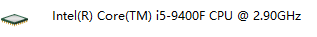

64字长

外存512gb

#### **数据传输速率**

每秒钟传输的（二进制）比特数

 S= 1/T(bps) T为发射1比特所需的时间

#### 补码 

**移码和补码符号位相反其余相同的**

补码的表示方法是:

正数的补码就是其本身

负数的补码是在其原码的基础上, 符号位不变, 其余各位取反, 最后+1. (即在反码的基础上+1)

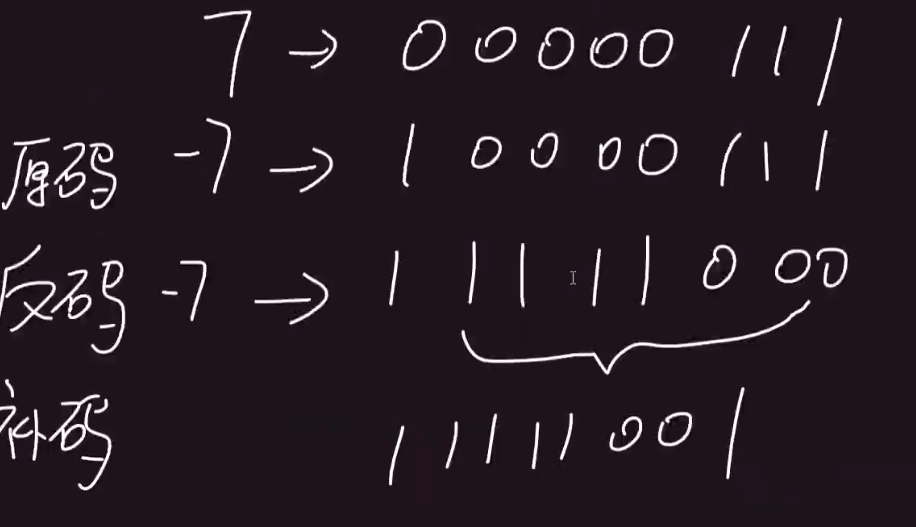

#### 浮点数

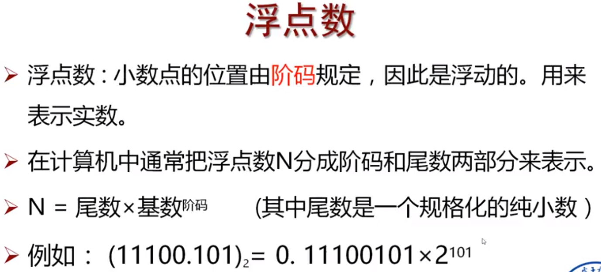

#### 浮点数计算（对阶）

1. **先要对阶**

对阶就是将两个数的阶码对为一致

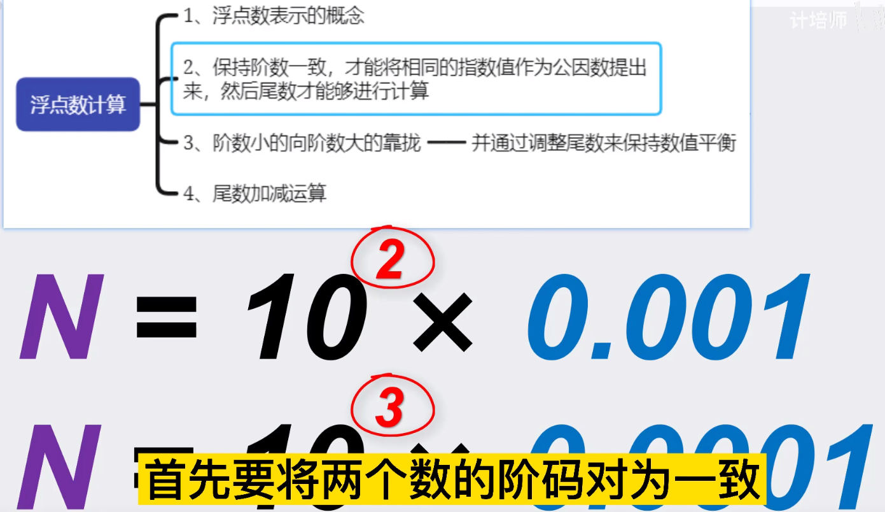

#### 进制转换

1. 

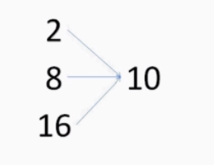

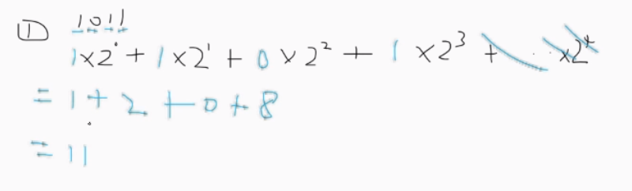

2. 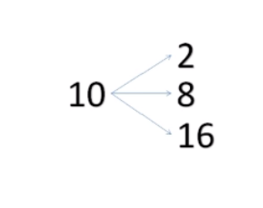

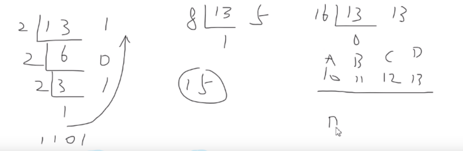

3. 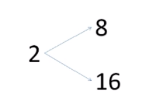

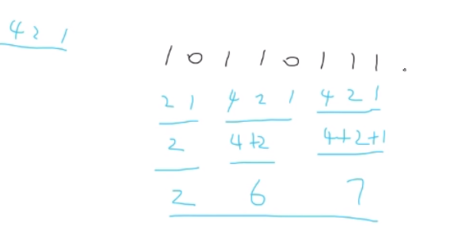

1248分组     上面是1做运算  不是就不做

#### 补码加减运算

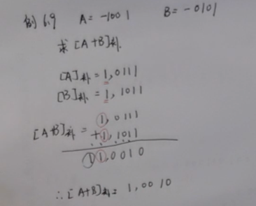

如果相同的符号位数做运算之后不变 那么 **未溢出**

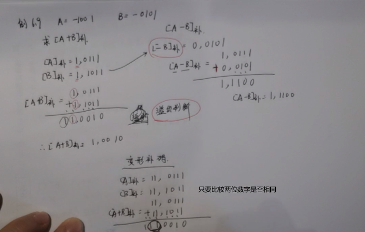

**相同未溢出**

#### 海明校验

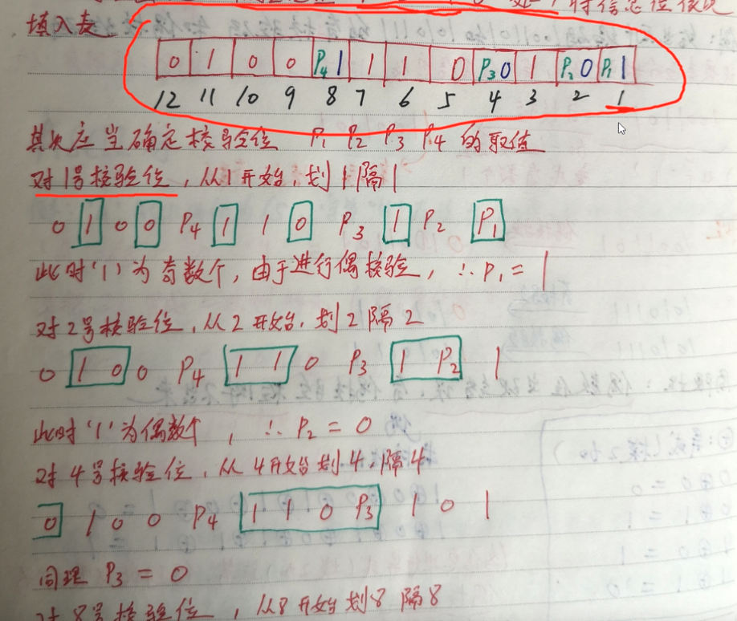

已经确定是8位的校验码，所以这边我直接可以写

**使用奇校验**   ： **一定要凑成奇数 个 1**  

#### 解析名词

1. 指令寄存器IR

用来保存当前正在执行的一条指令。是临时放置从内存里面取得的程序指令的寄存器，**用于存放当前**从主存储器读出的正在执行的一条**指令**。  指令寄存器在数据通路中

2. 程序计数器（PC，Program counter，）用于**存放指令的**

**地址**。为了保证程序(在操作系统中理解为进程)能够

连续地执行下去，CPU必须具有某些手段来确定下一条指令的地址   

程序计数器在数据通路中

#### 寻址方式

立即寻址   直接寻址   间接寻址   寄存器寻址  寄存器间接寻址

 

#### 虚拟存储器

在虚存管理中，虚拟地址空间:逻辑地址空间，大小受指令地址长度的限制

​							实地址空间:物理地址空间；大小受物理内存大小的限制

#### 计算机三级存储体系

计算机的存储体系中，“三级存储”指的是：Cache、主存储器、辅存储器
　　优点：Cache用来改善主存储器与CPU的速度匹配问题；辅助存储器用于扩大存储空间

​		缺点：给系统增加了额外的开销，用户与数据库之间数据传输要在三级结构中来回转换，三级结构需要保存结构进行管理

------------------------------------------------------------------------------------------------------------------------------

#### 随机存取（直接存取）

指的是当存储器中的数据被读取或写入时，所需要的时间与该数据所在的物理地址无关

例子：**数组**

#### 顺序存取

是一种按记录的逻辑顺序进行读、写操作的存取方法，所需要的时间与该数据所在的物理地址有关

例子：**链表**

#### 存储器逻辑图

p317  

#### 磁盘的存储容量计算

存储容量 = n×t×s×b

n：总盘面数；t：每面磁道数；s：每道的扇区数；b：每个扇区存储的字节数。

#### 向量中断和非向量中断的区别

向量中断：不同的中断有不同的入口地址，

非向量中断：只有一个入口地址。

对比：向量中断实时性好，非向量中断简单

向量中断------由硬件提供中断服务程序入口地址；
非向量中断------由软件件提供中断服务程序入口地址；

#### 中断向量和向量地址

中断向量：**中断服务程序**的**入口地址**

向量地址：指**中断向量**保存的内存单元的地址

#### DMA

传输将数据从一个地址空间复制到另一个地址空间，提供在外设和存储器之间或者存储器和存储器之间的高速数据传输

#### 中断方式与转子有何异同

转子程序无随机性，中断具有随机性

#### 分辨率

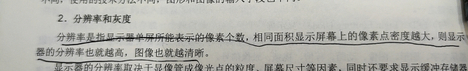

#### 激光打印

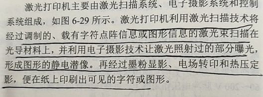

查找的话：

现代计算机的组成 硬件  软件  网络  外围设备

硬件：cpu 存储器 系统总线  io 接口

储存：寄存器，cache 内存 外存

CRC校验 可实现最好的检错、纠错效果

单符号位：符号位110或001则溢出

双符号位：两个符号位不同则溢出

CPU中没有 **虚拟内存 **            （寄存器，暂存器，cache）

指令访问 不可以访问 **暂存器  **   （寄存，cache，虚拟内存）

不包含在数据通路  **指令译码器**  （寄存，暂存，指令寄存器）

一个机器周期包含多个指令周期        **错的**

指令的结构   **必须有操作码   可以没有操作数**

#### 寻址相关

**立即寻址**： 指令中包含操作数    操作数在程序存储器中

**直接寻址**： 指令中包含操作数地址  操作数不在程序存储器中

**间接寻址**： 指令中不包含操作数     指令中不包含操作数地址

**相对寻址**:    位移量是有符号数 		位移量一般用补码表示

#### 冯诺伊曼的思想

1、计算机硬件设备由存储器、运算器、控制器、输入设备和输出设备5部分组成。

2、存储程序思想——把计算过程描述为由许多命令按一定顺序组成的程序，然后把程序和数据一起输入计算机，计算机对已存入的程序和数据处理后，输出结果。

