基础很重要项目经验放一放 

面试题一定要去理解  

在看别人的源码的同时能够看懂别人的思想

# 技巧篇

1. 自信礼貌先发制人
2. 面试交流是双向的
3. 学会认可面试官
4. 表明立场 


### 虚拟Dom 

数据改变导致试图更新

v8很快    js引擎最好用js表示dom 

虚拟dom有三个属性tag，props，children

#### Diff 算法  

1.遍历老的虚拟dom 2. 遍历新虚拟dom 3 重新排列

优化：只比较同一层级  

标签名不同直接删除

标签名相同 key相同 不继续深度比较  


如果相同key相同将会执行pathVnode    


### 深浅拷贝 

### flex布局的 

### vue2.0的生命周期

实例销毁前干嘛

发送请求写在哪里

### 浏览器页面渲染过程

### 预编译

函数：AO  函数内部作用域  将变量和形参名当作ao对象的属性名，值为undfinend

GO 是全局的作用域

ao在go的前面

```javascript
function fn(a, c) {
    console.log(a);  // function a(){} 
    var a = 123
    console.log(c);  // function c(){}
    console.log(a)  // 123
    function a() {
    }
    if (false) {
        var d = 678
    }
    console.log(d) // un
    console.log(b)  // un 
    var b = function () { }
    console.log(b) // function () { }
    function c() {}
    console.log(c) // function c(){}
}
fn(1, 2)
// ao{ a : function a(){}  c :function c(){} d :un  b: un }
```

解决方法： 找到变量和形参名作为ao对象的属性 然后他的值为undifined     

###     闭包

是函数作用域的特性导致的闭包

让变量保存在函数的外部保留

```javascript
function a(){
    var aa =123
    function    b(){
        var bb=234
        console.log(aa)
    }
    return b
}
var res =a()
 res()
```

输出 123   

防抖和节流就是利用到了闭包，将变量保留到了函数的外部

1. 单例模式的闭包

```javascript
    <button id="loginBtn">登入</button>
    <script >
    var createLogin = function(a,b,c){
    console.log(a,b,c);
    var div=document.createElement("div");
    div.innerHTML ='我是登入的单窗'
    div.style.display="none"
    document.body.appendChild(div)
    return div
}
var getSingle=function(fn){
    var result ;
    return function(){
        return result||(result=fn.apply(this, arguments))
    }
}
var create =getSingle(createLogin)
document.getElementById('loginBtn').onclick=function(){
    var loginLay =create(1,2,3);
    loginLay.style.display="block"
}
    </script>
```

###  js 的事件循环机制eventloop

​			调用栈，微任务队列 ，消息队列

宏任务：                                                 

- script
- setTimeout
- setInterval
- setImmediate
- I/O
- requestAnimationFrame
- UI rendering

微任务：

- process.nextTick
- promises
- Object.observe
- MutationObserver


1. js中的异步操作比如fetch setTimeout setInterval 压入到调用栈中的时候里面的消息会进去到消息队列中去消息队列中 会等到调用栈清空之后再执行
2. promise async await的异步操作的时候会加入到微任务中去会在调用栈清空的时候立即执行

**微任务优先于消息队列**

### BFC是什么？

**块级格式化上下文**

独立的块级渲染区域   **只有block-level BOX 参与**

**一套渲染的规则来约束盒子的布局**和**外部是没有关系的**

如果一个盒子不设置height 当元素都是浮动的无法撑起自己

那么这个盒子就没有bfc

1. 如何去创建bfc 

float 值：不是none     是 left 

 position值：不是static 或者relative       是  **abouslute**

dispaly值是：inline-block，flex，inline-flex

**overflow：hidden；**    // 最好的方式

都会形成BFC

2. 作用

**取消盒子margin 的塌陷**

BFC可以阻止元素被浮动元素覆盖 


### 实现css 三角

```javascript
<div style="width:0;height:0; border :240px solid ;border-color:transparent transparent transparent  red "> 
```

### 深浅拷贝

数据存储

一般的：

```javascript
Number,string boolean,null, undefined, Symbol
```

引用的数据类型

```
对象（数组  map set）  
```

1. 如何存储？一般的数据类型放在栈里面  对象的属性名放在栈里面但是值放在堆里面

2. 赋值和浅拷贝的区别？  浅拷贝：必须要创建一个**新的对象 新的房间**，**拷贝的值**（拷贝的属性）如果是一般的**数据类型**那拷贝的就是**基本类型的值**，如果属性是**引用数据**那么拷贝的就是**内存的地址**  拷贝前和拷贝后是互相影响的
3. 深拷贝：如果属性是引用的数据类型那么会开辟一个新的房间

```javascript
    <script>
        var person={name: "mike"}
        var person1={name: "John"}
        function shallowClone(source) {
            var newobj = {};
            for (var key in source){
                if(source.hasOwnProperty(key)){
                    newobj[key] = source[key];
                }
            }
            return newobj;
        }
        var person1=shallowClone(person)
        person1.name='科比'
   console.log(person.name);   // mike
   console.log(person1.name);  // 科比
    </script>
```

### 深拷贝

结合vue  

最简单的深拷贝就是JSON.stringify()

但是存在一些问题：

\1. undefined、任意的函数以及 symbol 值，在[序列化](https://www.zhihu.com/search?q=序列化&search_source=Entity&hybrid_search_source=Entity&hybrid_search_extra={"sourceType"%3A"article"%2C"sourceId"%3A317773020})过程中会被忽略

\2. Date 日期调用了 toJSON() 将其转换为了 string [字符串](https://www.zhihu.com/search?q=字符串&search_source=Entity&hybrid_search_source=Entity&hybrid_search_extra={"sourceType"%3A"article"%2C"sourceId"%3A317773020})（Date.toISOString()），因此会被当做字符串处理。

\3. NaN 和 Infinity 格式的数值及 null 都会被当做 null。

\4. 其他类型的对象，包括 Map/Set/WeakMap/WeakSet，仅会序列化可枚举的属性。

\5. 对包含[循环引用](https://www.zhihu.com/search?q=循环引用&search_source=Entity&hybrid_search_source=Entity&hybrid_search_extra={"sourceType"%3A"article"%2C"sourceId"%3A317773020})的对象（对象之间相互引用，形成[无限循环](https://www.zhihu.com/search?q=无限循环&search_source=Entity&hybrid_search_source=Entity&hybrid_search_extra={"sourceType"%3A"article"%2C"sourceId"%3A317773020})）执行此方法，会抛出错误。

### 登入验证

1. 基本的流程： client（浏览器端）  发送用户名和密码的post 请求，服务端验证通过放入session中   **给client返回**一个sessionid 存放在cookie中  发送带有sessionid和cookie （检查是否正确或者是失效） 的请求给后端（服务端）从内存获取用户信息，返回响应信息

2.  **弊端：在多台服务端的情况下可能会发生重新登入的情况**，因为后端**返回的session id**不同服务器之间不同
3. token 解决了这个问题：  不管服务器有多少就是要走redis  就是讲session id 和token 存放在redis 里面 最终直接走redis 
4. jwt也解决了这个问题  ： 服务端在收到post 之后 生成一个jwt密钥，返回给浏览器  浏览器将密钥放在请求头（二次封装axios放在header.authorization），发送给服务端 服务端(利用到koajwt)验证之后得到用户信息从jwt中，最终再交给客户端浏览器端

### symbol   

是一般的 数据类型不用new 的关键字 ， 是唯一的 。 NaN 也是唯一的

```javascript
var game = {
    pg:Symbol('pg'), 
    sg:Symbol('sg'), 
    sf:Symbol('sf'), 
}
function createRole(type) {
    if(type === game.pg) {
        console.log('控球后卫');
    }else if(type === game.sg) {
        console.log('得分后卫');

    }else if(type === game.sf){
        console.log('小前锋');
    }
}
createRole(game.pg)
```

###   去重

1. Set 方法来去重     set 编程array         利用array.form          **Set 内部原理**..
2. 扩展运算符 
3.   两次循环 

```javascript
var arr = [1, 1, 1, 1, 1, 1, 1, 1, 1, 1, 1, 1, 1, 5, 6, 7, 5, 5, 6, 6, 6];
        function uniquer(arr) {
            return [...new Set(arr)]
        }
        console.log(uniquer(arr));
```

4. indexof 

5. filter

### JS延迟加载的方法有哪些？

 script标签加async / defer      setTimeout 定时器

### new操作符为什么能创建一个实例对象

空对象  继承构造函数原型 this指向改变调用构造函数 ， 返回对象 

### 文档碎片？

用来存放dom的元素 document.createDocumentFragment() 

当大量的dom元素需要被操作时我们可以先将他们放在文档碎片中最后一步操作

#### compose 是什么？  

一种函数 ，  

```javascript
    const space = (str) => str.split(' ')
    const len = (arr) => arr.length
    const compose = (...fn) => value => {
            return fn.reduce((value, fn) => {
                return fn(value)
            }, value)
        }
     const computedWord = compose(space, len)  
     console.log(computedWord('i am linsanxin'))
```

space 和  len  是两个函数 ，  之后 传入两个函数到compose 之后就可以计算出结果

#### 浏览器渲染

dom渲染

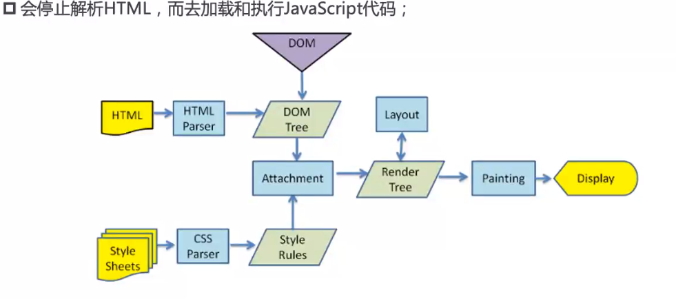


解析js ：

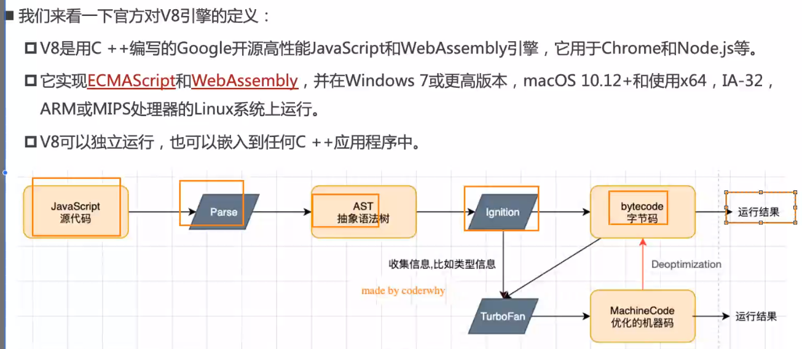

1. 转化成字节码的原因是因为要适应不同的cpu架构 而转成相应的机器码
2. parse  词法分析  语法分析 
3. ast语法树 网站：[AST explorer](https://astexplorer.net/)
4. ignition 是转化库 解析器  
5. turbofan   存储那些反复执行的代码    将函数标记成hot 收集起来

：源码

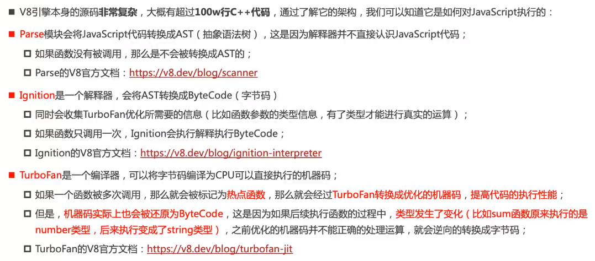

**单个代码的流程 :**

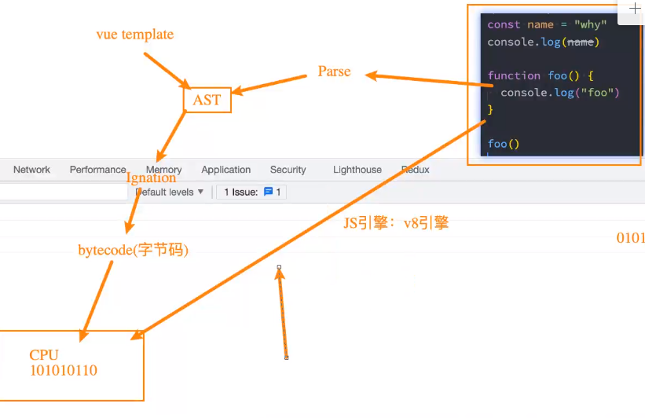

**v8解析图**

**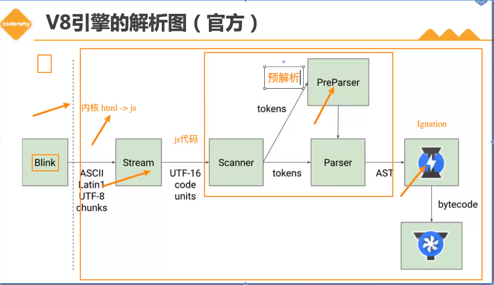**

1.  预解析 preparser   因为有方法虽然写了但是不一定被调用所有先是预解析

为了提高效率     lazyparsing  延迟解析

#### 函数调用执行过程

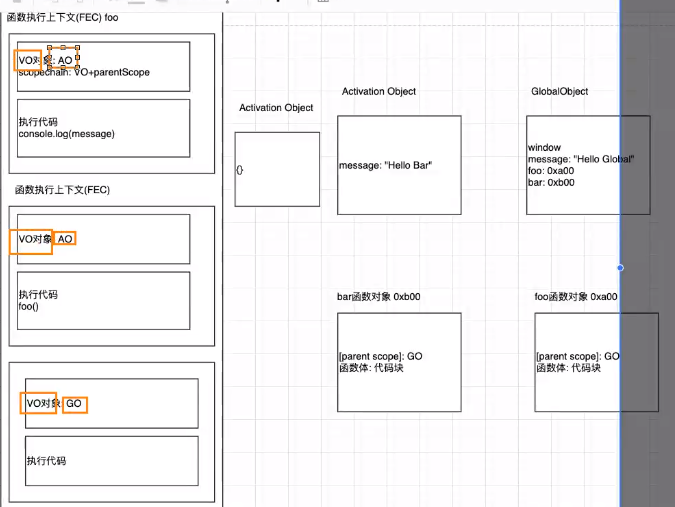

VO 是堆   存放对象

AO 是栈 存放 变量  

#### 内存管理

1. 申请空间
2. 使用内存空间
3. 释放空间

手动 ： c c++     malloc函数来申请空间

自动：java  js  python  自动管理

**内存分配方式**

基本数据类型的内存分配时在**栈**空间

复杂数据类型内存的分配  **堆**内存 

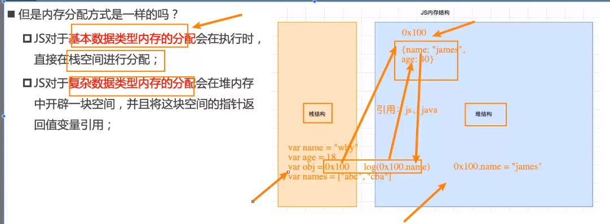

#### JS的垃圾回收

1. 在语言的运行环境都有自己的垃圾回收器  java 在jvm中  js 在js引擎中
2. GC  就是垃圾回收器

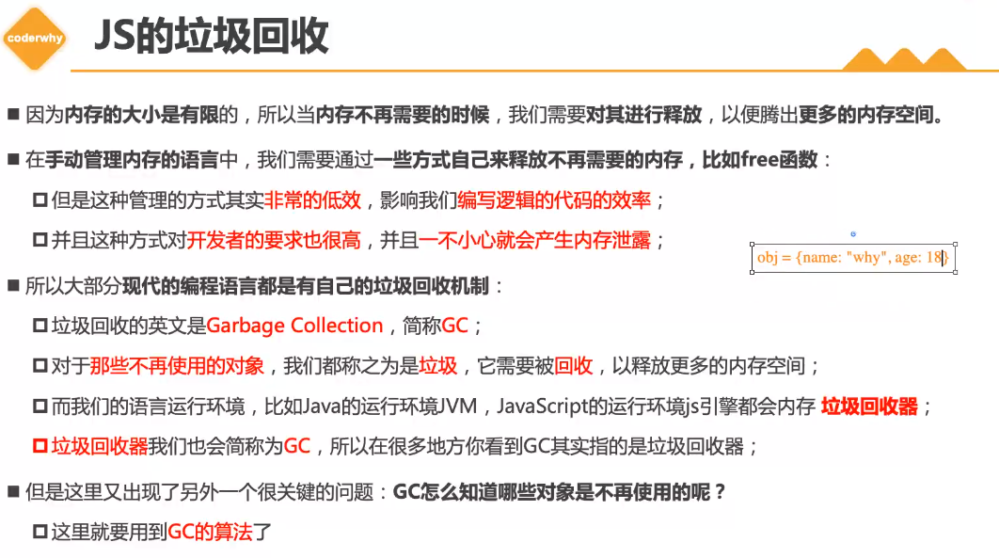

GC算法： （他怎么知道我哪个东西不要！）

1. **引用计数** 

每一个引用的对象都有一个 **引用计时器** 当被引用的时候就+1  如果没有被引用就-1 最后如果引用计数值为0  **那么他就要被销毁**

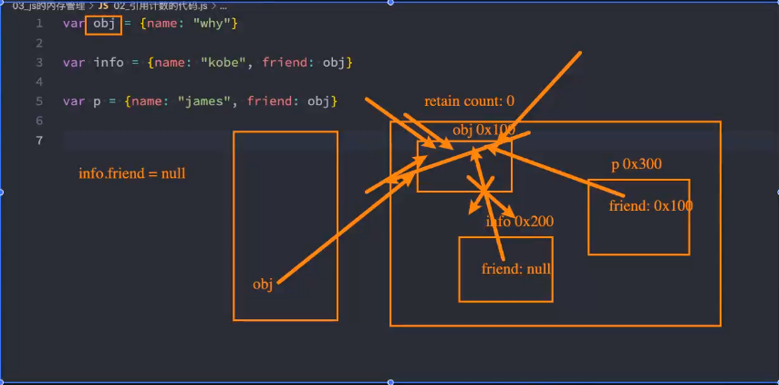

**弊端**： 循环引用。  

```javascript
var obj1={friend:obj2}
var obj2={friend:obj1}
```

你指向我，我指向你  ，那么永远不会被销毁 造成**内存泄漏**

2. 标记清除

设置一个根对象，垃圾回收器会**时不时** 从这个根找到所有引用的对象，对于那些没有引用到的对象 就标记不到， 认为时不可用的对象

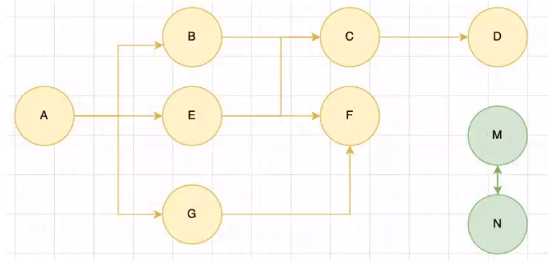

从A 开始 到达不了M-N   就算他们互相的去引用也没有用 还是会被销毁    

解决了循环引用的问题。 

#### JS函数是一等公民

为什么？ 因为他可以   1. 作为**其他函数的参数**     2. 作为返回值使用  3. 在函数内部可以定义函数

高阶函数（函数作为参数）和柯里化 （将多个参数拆分成一个个参数用函数去接受）

**数组中的方法**

filter ,map ,forEach ,find(返回第一个找到的数字) / findindex（返回找到的索引） , reduce 


#### 闭包

1. 定义

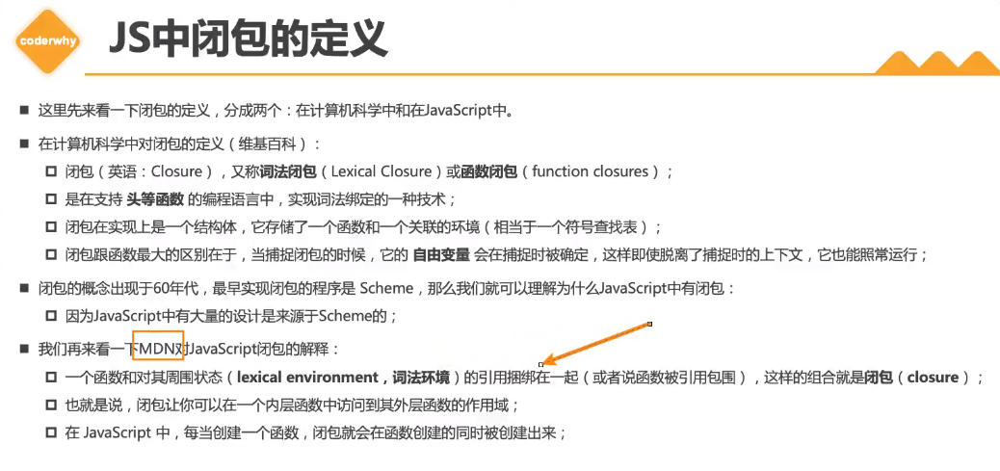


过程

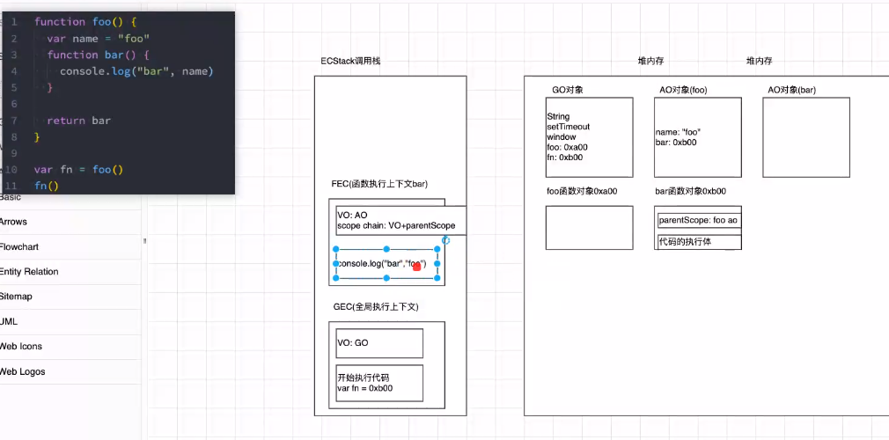

#### this指向

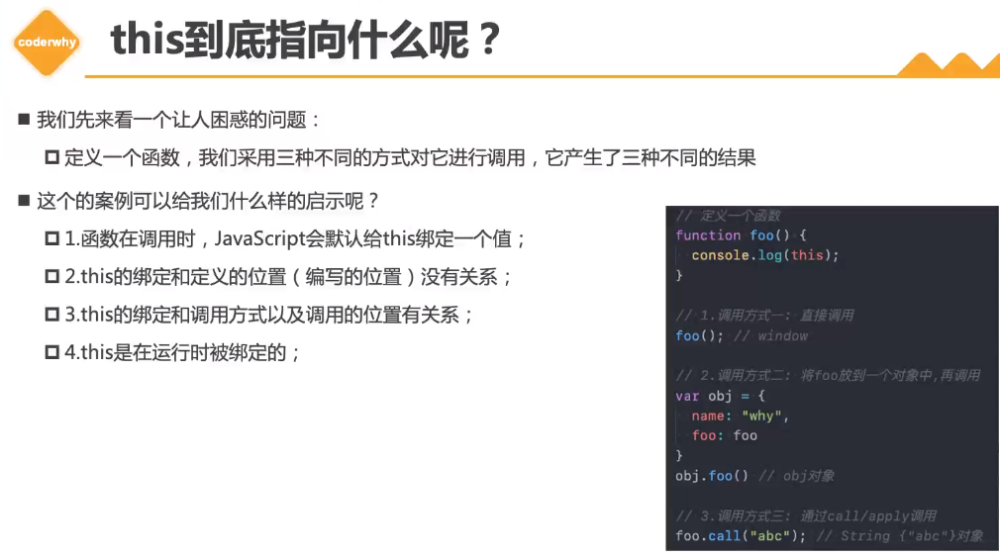

**四个绑定规则**

1. 默认绑定  默认是在window  
2. 隐式绑定  在对象中引用函数   这个引用间接的将函数绑定在了对象上面
3. 显示绑定 apply call   bind  原型上的方法 
4. new绑定

bind 生成一个新的函数 ，修改作用域的新函数 ， 显示的绑定

1. 内置函数系统api的

foreach 和map 一般都可以修改this  

2. **绑定的优先级**

new > 显示绑定(bind)>隐式绑定

3. 特殊的绑定

箭头函数 ： 不绑定this., arguments 属性 不作为构造函数   不可以new  

常见的简写： 1. 如果参数只有一个小括号可以省略   2. 如果函数执行体只有一行代码那么可以省略，并且将执行结果作为返回值（一个表达式计算结果）  3.如果只有一行代码并且返回一个对象 那么需要用小括号 

```javascript
 var nums = [1,2,12,48,786,123]
        var result = nums.filter(item => item % 2 === 0)
            .map(item => item * 100)
            .reduce((prev, next) => prev + next);
        console.log(result);
```

#### 纯函数？ 副作用？ 

1. 函数在相同的输入值产生相同的输出
2. 输出和输入值以为的其他隐藏信息或者状态无关，也由io设备产生的输出无关
3. 不能有语义上可观察的函数副作用，触发事件，使输出设备输出，或更改输出值意外物件的内容

总结： 确定的输入一定会产生确定的输出，函数在执行过程中不能产生副作用

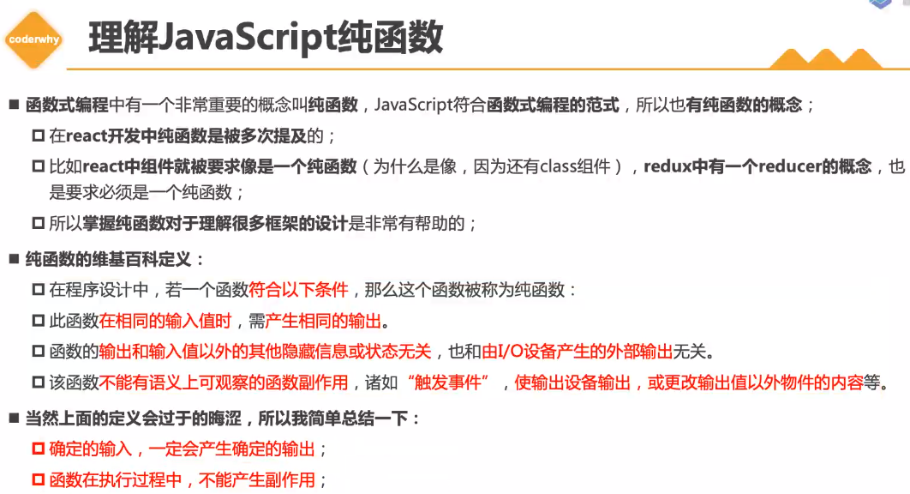

**副作用的理解**

在执行一个函数的时候，除了返回函数值以外，**还修改了全局变量修改参数或者修改外部的存储  **

**优势 :  **

**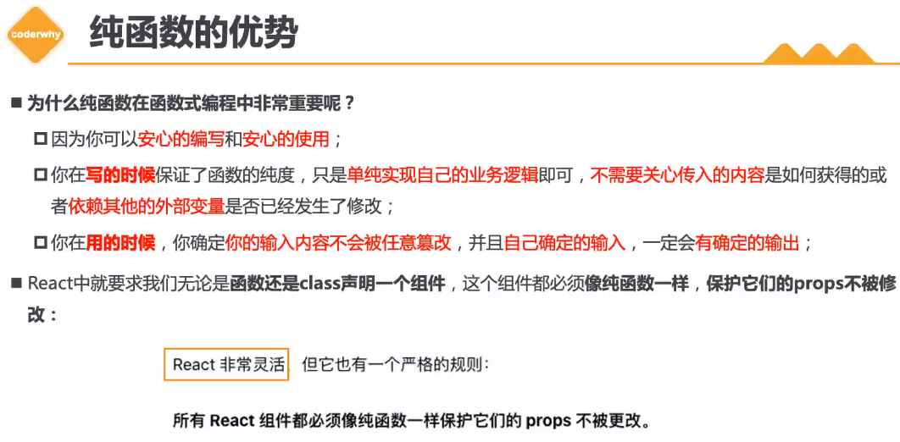**


#### 柯里化

一部分参数被分成一个个函数去处理参数 

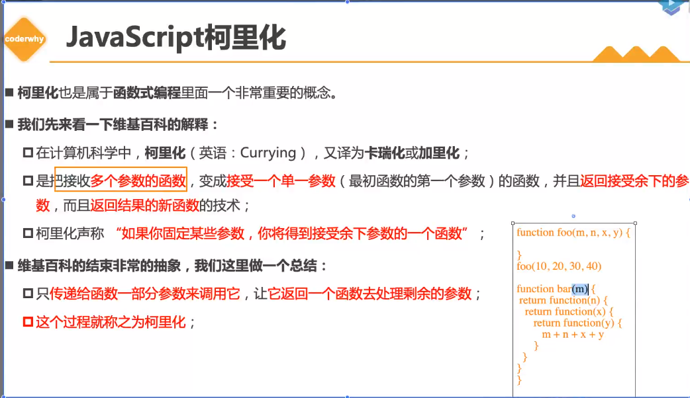

 

